# Крокуємо в Sadok

## Вхід в адміністративний профіль

- Завантажуємо застосунок, обираємо свій варіант операційної системи за посиланнями:
  - [Android](https://play.google.com/store/apps/details?id=app.sadok.sadok_app&pli=1)
  - [Apple iOS](https://apps.apple.com/ua/app/sadok/id6479316640)

Чи скануємо **QR-код**, та на сайті обираємо потрібну операційну систему:

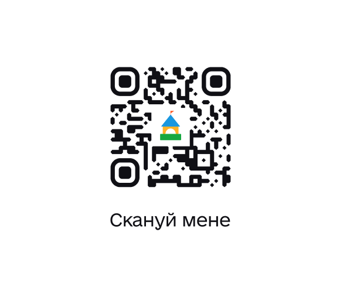

- Входимо під номером закладу, зареєстрованим в системі. Код прийде в **SMS**.

:::info А який номер був внесений?
Основний **номер закладу** чи керівника. Тож варто запитати у особи, що здійснювала реєстрацію закладу в системі.

Якщо залишилося питання, то можна [запитати в менеджера Sadok в Telegram-чаті](https://t.me/sadokapp).
:::

## Профіль закладу

Переходимо в розділ **"Профіль"** в нижньому меню застосунку. Саме тут відбуваються основні налаштування.

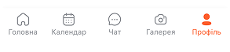

### Інформація про заклад

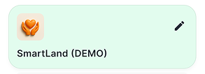

Вносимо всі дані про заклад: **Профіль** > **Олівець** на зеленому фоні (розділ інформації про ваш заклад в режимі редагування) > Заповнюємо відповідні поля інформації, посилання на соцмережі, контакти > **"Зберегти"** у верхньому правому куті.

:::info
Також система пропонує йти по **Стартовому чек-листу** на **Головній**. Він допоможе зробити перші кроки по внесенню користувачів та груп, тож можна слідувати по його маршруту, а можна крокувати далі по цій інструкції. Вибір за вами :)
:::

### Налаштування

Персоналізуємо систему під внутрішні правила та процеси:

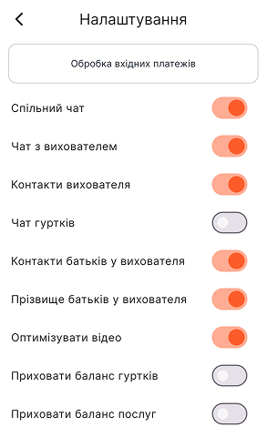

- **Обробка вхідних платежів** - підключення банкінгу до системи для автоматичного рознесення оплат в профілі дітей. Інструкція в розділі "Оплати по API".
- **Спільний чат** - Використовуєте групові чати - залишайте увімкненим, якщо ні - вимикаємо.
- **Чат з вихователем** - Дозволяєте особисте спілкування батьків з вихователем - вмикаємо, якщо все через адміністратора - вимикаємо. В будь-якому випадку ці чати залишаються у вас під контролем ;)
- **Контакти вихователя** - Відкриваємо номер телефону вихователя у батьків? Так - вмикаємо, ні - вимикаємо.
- **Чати гуртків** - Додаємо чати ще окремо по гурткам? Так - вмикаємо, ні - вимикаємо.
- **Контакти батьків у вихователя** - Відображаємо номер батьків у вихователя? Так - вмикаємо, ні - вимикаємо.
- **Прізвища батьків у вихователя** - Відображаємо прізвища батьків у вихователя? Так - вмикаємо, ні - вимикаємо.
- **Оптимізувати відео** - Швидке завантаження фото та відео у вихователя - рекомендовано вмикати.
- **Приховати баланс гуртків** - Приховуємо стан балансу, реквізити для оплати по гурткам у батьків? Приховуємо - вмикаємо, показуємо - вимикаємо.
- **Приховати баланс послуг** - Приховуємо стан балансу, реквізити по основним послугам у батьків? Приховуємо - вмикаємо, показуємо - вимикаємо.

### Працівники

Формуємо список команди закладу.

- **Профіль** > **"Додати працівника”** (кнопка доступна при умові пустого списку) або натискаємо **"+"** у верхньому правому куті > Вносимо імʼя, прізвище, основний номер телефону, дата народження > **“Додати”**

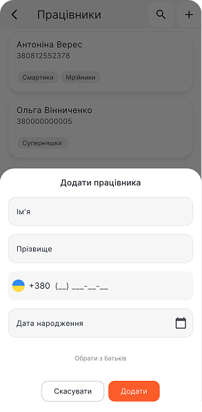

#### Працівник і матуся вихованця одночасно - що робимо?

- Вносимо користувача одразу в список **“Батьки”**, додаємо дитину до цього профілю (див. наступний розділ "Батьки та діти").
- Повертаємося до списку **“Працівники”** > **“+”** > **“Обрати з батьків”** під полем дати народження > Обираємо зі списку > **“Додати”**

### Батьки та діти

Формуємо основну **клієнтську базу** батьків та вихованців закладу:

- Додаємо батьків: **Профіль** > **Батьки** > **“+”** у верхньому правому куті > Дані одного з батьків (згідно [Політики конфіденційності Sadok](https://sadok.app/privacy-policy/) рекомендовано вносити особу з договору) > **“Додати”**

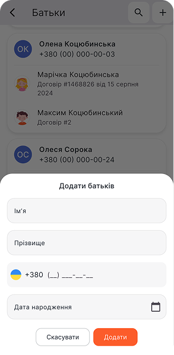

- Додаємо дитину до батьків: Профіль батьків > Помаранчевий **“+”** під основним номером > Дані дитини > **“Додати”**

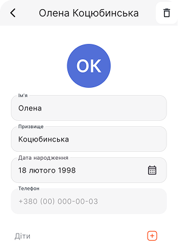
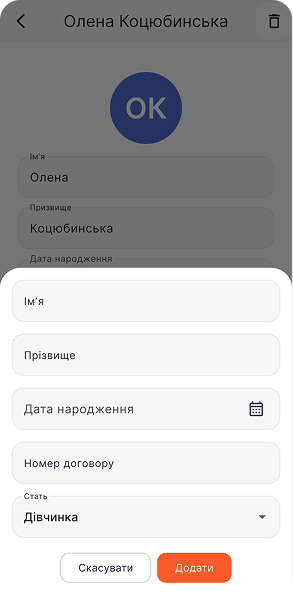

:::warning Вони одразу дізнаються, що внесені?
**Ні**, користувачам не приходять миттєве сповіщення про внесення їх в систему. Тож спокійно налаштовуйте заклад, потім їх запросите на все готове ;)
:::

:::info Чому одного? А як бути з іншим?
Згідно [Політики конфіденційності Sadok](https://sadok.app/privacy-policy/) можемо надавати інформацію про дитину тільки тим, з ким юридично оформлена взаємодія. А ця особа вже може доєднати до аккаунт дитини всіх, кого вона вважає за потрібне, просто **поділившись SMS** ⬇️
:::

**Інструкція для батьків по підключенню до аккаунту дитини інших відповідальних осіб** (матусь, татусів, бабусь, дідусів, старших братиків та сестричок, нянь та тьюторів...):

1. На мобільному присторої додаткової відповідальної особи завантажується застосунок Sadok (розділ "Вхід в систему").
2. В поле номеру вноситься основний номер аккаунту дитини (внесений в систему). SMS приходить на основний номер!
3. Основна контактна особа надає код для входу, який їй приходить в SMS.

Підключення робиться один раз, далі доступ дійсний до натискання кнопки "Вийти з профілю".

### Діти

А тут вже магія ✨ Цей розділ сформується автоматично. Але ви зможете додати деталей до кожної дитинки:

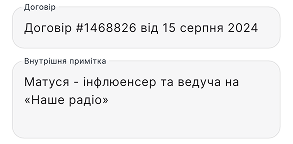
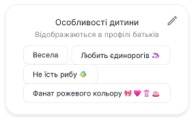

- **Номер договору** (рекомендовано)
- **Внутрішня примітка** - важлива інформація від батьків, попередження по взаємодії з дитиною, харчові особливості та алергії, знижки чи ососбливі умови відвідування закладу тощо (для працівників закладу)
- **Особливості дитини** - тут вносимо її вподобання, особливості розвитку, темперамент, досягнення тощо.

:::warning
“**Особливості дитини**” відображаються **у профілі батьків**, а “**внутрішня примітка**” доступна і **вихователям** групи.
:::

**Як виглядатиме ця інформація у батьків?**

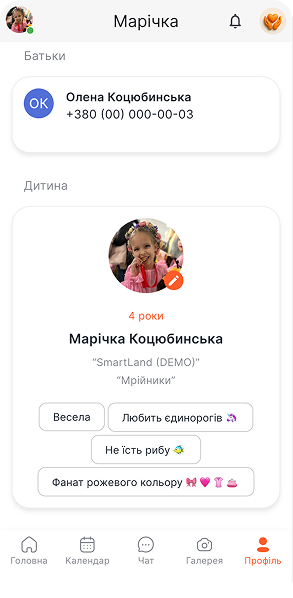

### Групи

Формуємо нашу організаційну структуру - основні функціональні групи:

- Створюємо нову групу, починаємо з назви: **Групи** > **“+”** > Назва групи > **“Створити”**

У вас зʼявиться перша група. Відкриваємо її та вносимо інформацію далі...

- Лого, опис, максимальна кількість вихованців: Група > **“Олівець”** у верхньому меню (режим редагування) > **“Олівець”** напроти назви групи > Обираємо лого з галереї чи генеруємо з ШІ, вносимо максимальну кількість вихованців групи, опис > **“Зберегти”**

:::info Якщо немає лого?
Не проблема - можете скористатися **ШІ-помічник** для генерації. Просто натисніть на "..." на полі логотипу, оберіть чарівну паличку 🪄 "**Згенерувати лого**" та внесіть додатковий опис, натисніть "**Створити**"
:::

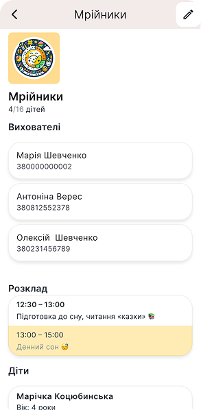
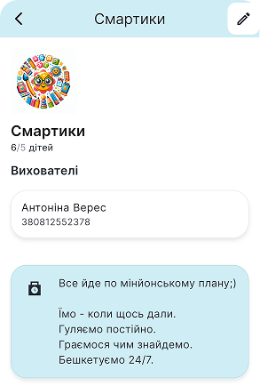

- Вносимо відповідальних: Група > **“Олівець”** зверху > **“+”** біля **“Вихователі”** > Обираємо зі списку працівників чи “Додати нового вихователя” (перехід в розділ "Працівники", де вносимо нового співробітника)

- Вносимо дітей: Група > **“Олівець”** зверху > **“+”** біля **“Діти”** > Обираємо зі списку дітей чи “Додати нову дитину”

:::warning
**Дитина може бути зарахована тільки в одну групу**!  
Щоб "перевести" дитину з однієї групи в іншу, потрібно одразу видалити в попередній та додати в нову.
:::

- Документи групи: Група > **“+”** біля **“Документи”** > Вказуємо назву файлу > “Вибрати документ” чи “Вибрати з галереї”

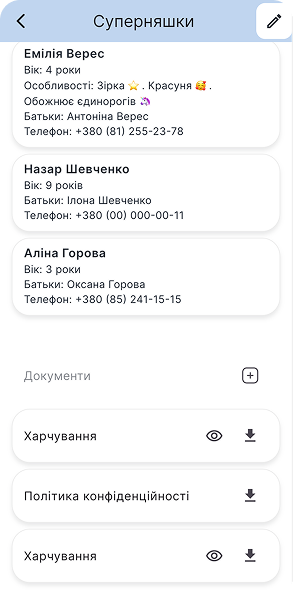

:::info
Рекомендовано додавати документи групи у форматі зображень, тоді у батьків ця інформація буде відображена у вигляді галереї. Див. нижче ⬇️
:::

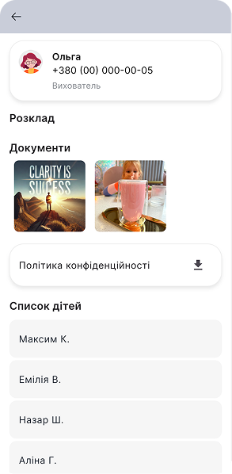

### Розклад групи

Створюємо інтерактивний розклад, що буде відображатися у батьків та вихователів групи:

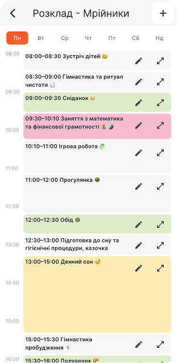

- Група > **“Олівець”** (режим редагування) > **“Олівець”** напроти "Розклад" > Зверху обираємо **день** > **"+"** додаємо часові проміжки з описом активності

:::success
Для швидкого внесення та зручності **можна КОПІЮВАТИ розклад дня**. Тож вам потрібно внести тільки на один день, а далі копіюємо і редагуємо обрані активності.
:::

Кожну активність можна розфарбувати певним кольором, редагувати, змінювати тривалість та видаляти за натисканням "Олівця" на активності.

**Як розклад виглядатиме у батьків?**

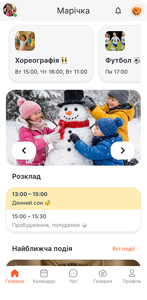
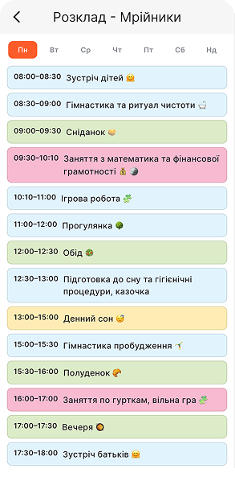

### Реквізити

Тут вказуємо всі **"шаблони" оплат** ваших послуг, всі можливі способи оплати. Можливо внести реквізити для оплати по: IBAN, карта, посилання на оплату та готівка.

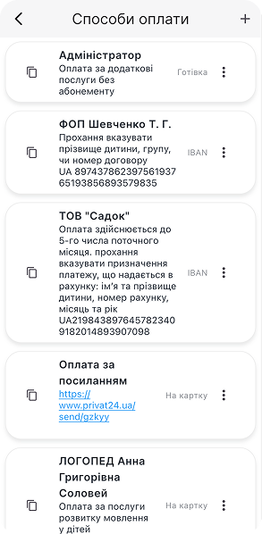

- Додаємо шаблони: Реквізити > **“+”** в правому верхньому куті > Обираємо **вид оплати**: IBAN, карта, готівка > Вносимо **дані** в наявні поля (далі є приклади) > “**Зберегти**”

Приклади інформації по полям:

1. Отримувач: *ПЗДО “Садок” чи ФОП Шевченко Т.Г.*
2. Опис способу платежу / Посилання на оплату: *Прохання обовʼязково вносити призначення платежу, вказане в рахунку чи одразу посилання https://www.privat24.ua/send/3wХХХ*
3. Призначення платежу (для рахунків): *Оплата за освітні послуги*
4. IBAN: *UA873687634976948746947973264938697836*

:::warning ВАЖЛИВО
В цьому полі **пишемо лише ПОЧАТОК** назви послуги, **система сама “допише”** в кожний рахунок імʼя та прізвище дитини, номер рахунку та оплатний період!
:::

### Послуги

Розділ для **шаблонів** основних **щомісячних, щотижневих та разових послуг**.

:::info
Також сюди вносимо **гуртки, які не мають чіткого розкладу**, наприклад, логопед з плаваючим графіком прийому, екскурсія тощо.
:::

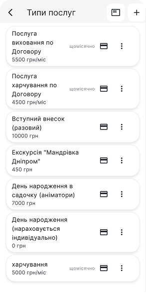

- Додаємо послугу, починаємо з назви: Послуги > **“+”** в правому верхньому куті > Вносимо назву > **“Додати”**

В списку зʼявиться нова послуга, яку далі редагуємо...

- Нова послуга > **...** > **"Редагувати"** > Вносимо вартість > **Щомісячна чи щотижнева?** Ставимо галочку ✔️ > **“Оновити”**
- Приєднуємо способи оплати до послуги: Нова послуга > **Картка 💳** на послузі > **Додати спосіб оплати** > Обираємо з шаблонів реквізитів

:::info
До послуги можна приєднати **декілька способів оплати**, повторивши кроки приєднання реквізитів. В рахунках батькам будуть надаватися всі вказані варіанти.
:::

**Коли нараховуються щомісячні та щотижневі послуги?**

:::warning
Щотижнева послуга буде нараховуватися автоматично у баланс дитини **щопонеділка**, щомісячна - кожного **1-го числа** місяця.
:::

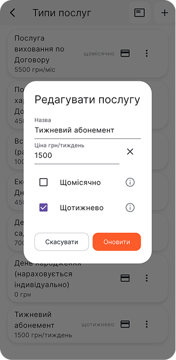
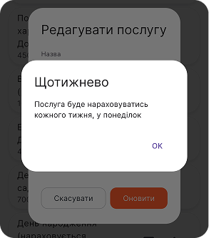

**Як батьки бачитимуть ці реквізити та де?**  
В профілі дитини на кожній підключеній до дитини послузі та гуртку буде відображатися картка 💳. Натискаючи на картку батьки бачитимуть список реквізитів:

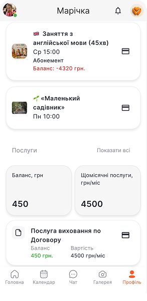
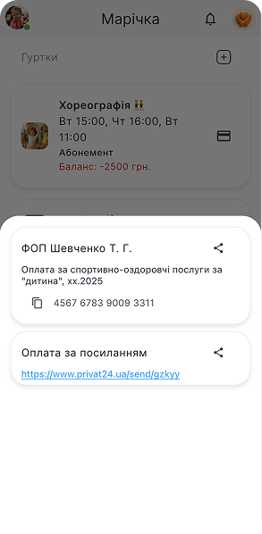

### Рахунки

Виставлення рахунків по основним та додатковим послугам.

:::warning Крок №1
**ПЕРЕВІРЯЄМО БАЛАНСИ ВСІХ ДІТЕЙ** в розділі "Діти": заборгованості, правильність вартості послуги, індивідуальні знижки тощо. **Система братиме вартості саме з профілів**!
:::

- Генеруємо рахунки: Профіль > Рахунки > Верхній розділ **"Усі"** або **“Чернетка”** > **"Сформувати рахунки"** > Обираємо послугу > **Активуємо** чи деативуємо кнопку "Нарахувати майбутній платіж щомісячної послуги" > "**Сформувати**"

**Що це за кнопка "Нарахувати майбутній платіж щомісячної послуги"?**

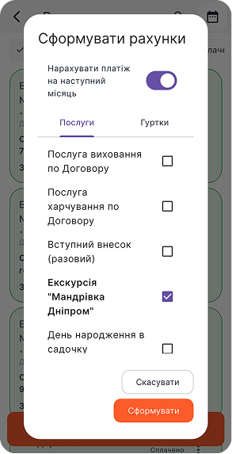

Кнопка "**Нарахувати майбутній платіж щомісячної послуги**" - це функція додання платежу за наступний місяць в рахунок, який генеруємо. Ця функція дійсна **тільки для щомісячних послуг**. Для разових послгу система вноситиме в рахунок тільки поточну заборгованість в балансі.

Приклад: *Маємо щомісячну послугу "Виховання по Договору" - це наш основний абонемент на садочок. Рахунок виставляємо 25-го січня (попереднього місяця) на лютий місяць (наступний), активувавши кнопку. Тож система візьме заборгованість з балансу дитини (за нявності) та додасть в рахунок платіж на лютий.*

- **Перевіряємо “Чернетки”** на правильність сум, реквізитів та коментарів в рахунках.

:::danger
В разі виявлення **помилок** - **ВИДАЛЯЄМО ВСІ рахунки** (кнопка у верхньому меню) та повертаємося до **Кроку №1** (розділ "Діти" та внесення коректних даних).
:::

- Натискаємо **“Опублікувати”**. Після цього рахунки перейдуть у вкладку “До сплати” (синій колір) та відобразяться у батьків та профілях дітей.

Покроково в картинках:

:::info Швидке ручне внесення коштів по рахунку
Через опублікований рахунок можна внести кошти в баланс дитини та позначити його сплаченим (зелений колір): Рахунок > **…** > **Внести кошти** > Далі > Номер квитанції чи коментар > Підтвердити
:::

:::info
⬜️ "**Білі**" рахунки - **чернетки**, це для внутрішньої перевірки, доступні лише адімінстратору закладу.  
🟦 "**Сині**" рахунки - **доступні батькам** в профілі дитини.  
🟩 "**Зелені**" рахунки - **сплачені**, доступні і батькам, і адміністратору для перегляду.
:::

### Рахунки по гурткам

Виставлення рахунків по додатковим послугам з каталогу гуртків: гуртки  
Аналогічно рахункам по основним послугам, починаємо з найголовнішого кроку - перевірки балансів дітей.

:::warning Крок №1
**ПЕРЕВІРЯЄМО БАЛАНСИ ВСІХ ДІТЕЙ** в розділі "Діти" чи в профілі гуртка, по якому виставляємо рахунки: заборгованості, правильність вартості послуги, індивідуальні знижки, коригування тощо. **Система братиме вартості саме з балансів по гуртку**!
:::

- Генеруємо рахунки: Профіль > Рахунки > Верхній розділ **"Усі"** або **“Чернетка”** > **"Сформувати рахунки"** > Перемикаємося на вкладку "**Гуртки**" > **Активуємо** чи деативуємо кнопку "Нарахувати майбутній платіж щомісячної послуги" > Обираємо потрібні гуртки > "**Сформувати**"

Покроково в картинках це виглядає так:

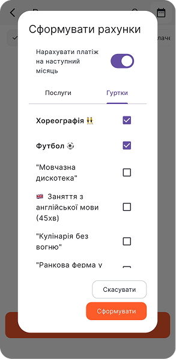
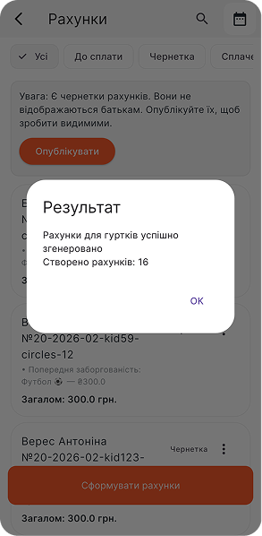
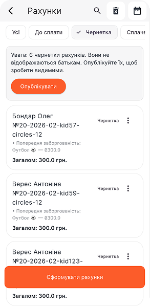
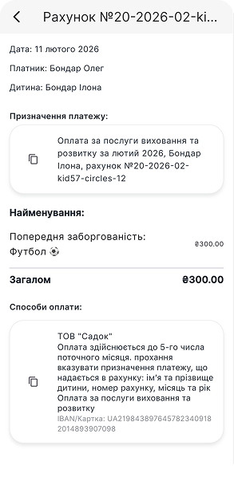
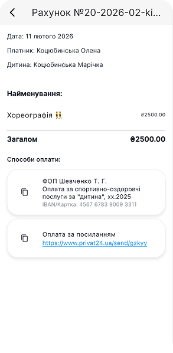
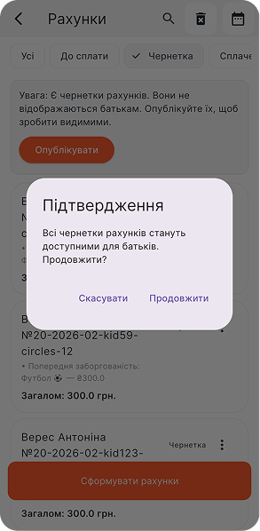
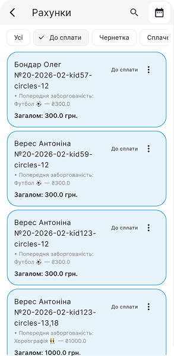

:::info
⬜️ "**Білі**" рахунки - **чернетки**, це для внутрішньої перевірки, доступні лише адімінстратору закладу.  
🟦 "**Сині**" рахунки - **доступні батькам** в профілі дитини.  
🟩 "**Зелені**" рахунки - **сплачені**, доступні і батькам, і адміністратору для перегляду.
:::

### Оплати по АРІ

Профіль > Налаштування > **Обробка вхідних платежів** > **"+"** у верхньому меню функцій > Обираємо банк > Слідуємо інструкціям банку

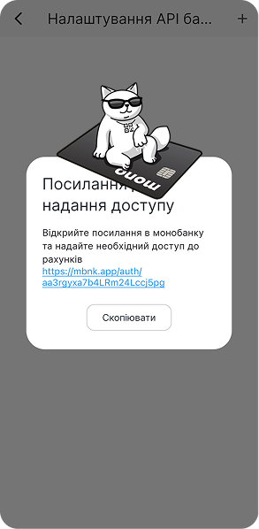
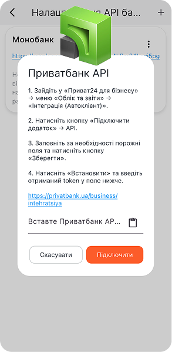

:::warning
Обовʼязковий крок - **обрати рахунок** зі списку доступних, який система моніторитиме для внесення оплат.
:::

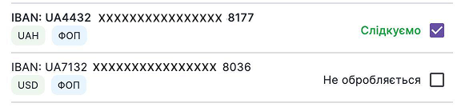

:::success
При успішному підключенні банкінгу оплати зʼявлятимуться в розділі **“Банківські платежі”** в профілі закладу та **автоматично будуть внесені в баланси дітей** з коректним призначенням платежу (зкопійованого з рахунку)
:::

:::danger
Оплата з некоректним призначенням платежу потребуватиме **ручного внесення** в баланс дитини (попередній розділ Рахунки > "Швидке ручне внесення коштів")
:::

## Автоматизація вже працює!

І знову магія ✨  
Після пройдених вище кроків вже автоматично створено:

- **База даних**: профілі всіх користувачів, послуг та джерел оплати
- **Чати з батьками**: групові, особисті з вихователями та адміністрацією закладу
- **Календар**: уже наповнений Днями народження всіх користувачів, а згодом буде і подіями
- **Галерея**: “територія емоцій” по групам, вихователі вже можуть додавати туди фото та відео діток
- **Відвідуваність**: розділ швидкого табелювання теж готовий до відміток присутності

Переходимо до додаткових послуг, студій та гуртків, ефективного інформування та прямої взаємодії з батьками...

## Головна - основний "дашборд"

Переходимо в розділ "**Головна**" по нижньому меню застосунку. Тут відображаються основні дані процесів, табелювання та інформування.

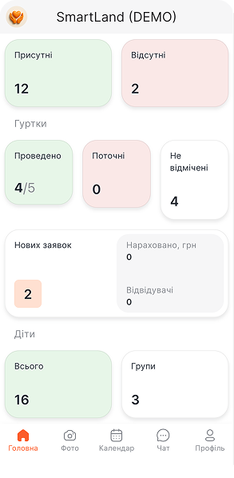

### Відвідуваність закладу

Головна > Відвідуваність > **"Не відмічені"** > Обираємо групу > **Ставимо відмітку ❌ тільки відсутнім** (інші автоматично рахуються присутніми).

Якщо **всі діти групи присутні**, то просто відкриваємо список дітей та закриваємо його, всі дітки позначаться як присутні.

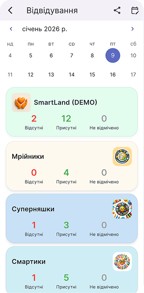
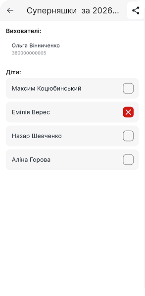

:::info
Табелювання доступне як **вихователю** групи, так і **адміністратору** закладу **на протязі всього робочого дня**.
:::

:::warning ВАЖЛИВО!
Інформація **за вчора не редагується**, майбутні дні також не доступні для табелюваня. Тільки "сьогодні". Тож важливо щоденно вести графік відвідуваності закладу.
:::

**У батьків відвідуваність** дитини також відображається в календарі ⬇️

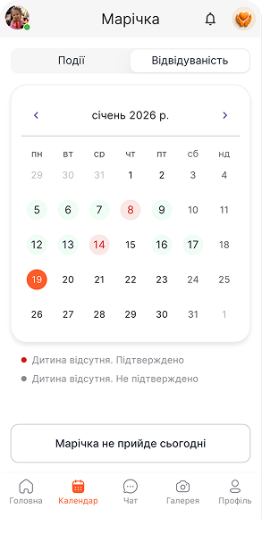
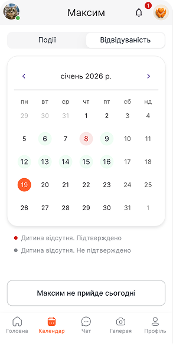

Батьки можуть попередити про планову відсутність дитини заздалегідь в календарі, натиснувши кнопку **"[Імʼя дитини] сьогодні не прийде"**.

**Як побачить вихователь та адміністратор попередження про відсутність?**  
Попередження буде виділено червоним кольором в списку дітей групи та потребуватиме підтвердження відсутності ❌ напроти дитини.

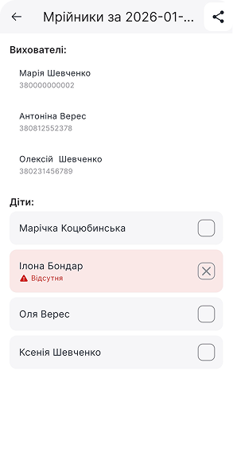

### Гуртки

Створюємо каталог додаткового розвитку, який буде відображатися у батьків. В даному розділі вони зможуть ознайомитися з детальною інформацією про гурток, вартістю, відповідальною особою та навіть **залишити заявку**.

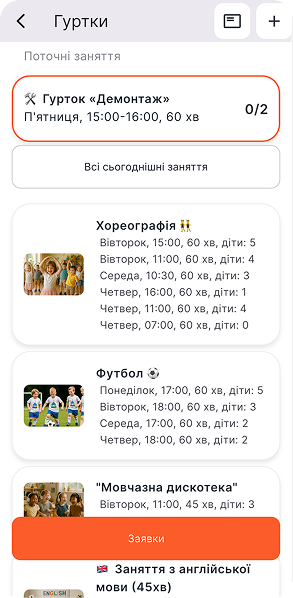

- Додаємо новий гурток: Головна > Гуртки > **"Проведено"** чи "Поточні" > **“+”** у верхньому меню > Вносимо назву гуртка > **“Додати”**

Зʼявиться новий гурток, тепер переходимо до його наповнення...

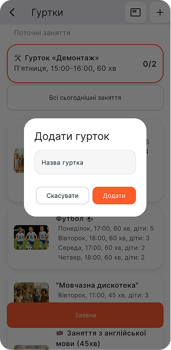
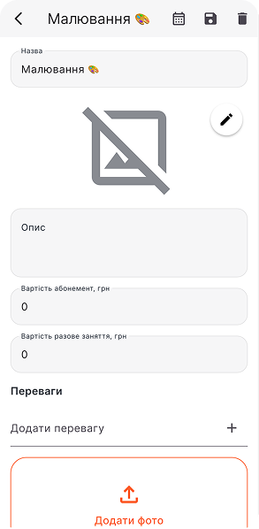

- Інформація про гурток: Новий гурток > **“Олівець”** зверху > Вносимо опис, головне зображення, вартість абонементу та разового заняття, переваги (додаємо плюсиком в полі "Додати перевагу"), додаткові зображення > **“+”** біля **“Викладач”** > Обираємо відповідального зі списку працівників
- Формуємо розклад гуртка: Гурток > **“Олівець”** зверху > **“+”** біля **“Заняття”** > Обираємо дань та час (формат часу - 15:00) > **“Додати”**
- Спосіб оплати: Гурток > **“Олівець”** зверху > **“+”** біля **“Способи оплати”** > Обираємо зі списку реквізитів

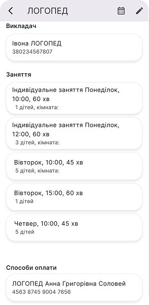
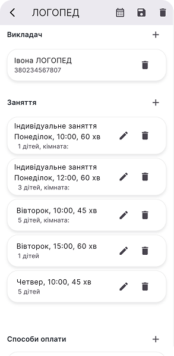

- Додаємо дітей до заняття: Гурток > переходимо в **Заняття**, наприклад: "Понеділок, 10:00, 60хв" > **“+”** зверху > Обираємо дитину зі списку

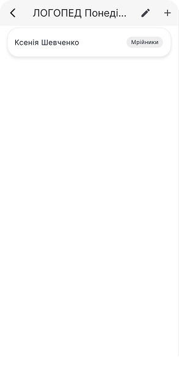
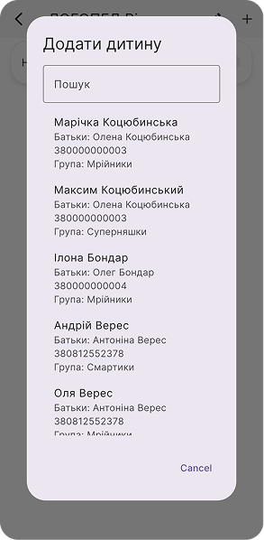

#### Абонементи, разові заняття

Коли діти розводілені по гурткам, їх баланси відображаються в профілях та інформації гуртка. Тож можемо налаштувати формат відвідування:

- Вмикаємо абонемент: Гурток > **Дитина** (обираємо внизу зі списку відвідувачів гуртка) > **Активуємо кнопку** напроти “**Абонемент**”

:::info
**Вартість абонементу** вказана **в описі гуртка**, саме його щомісяця система нараховуватиме в баланс дитини.
:::

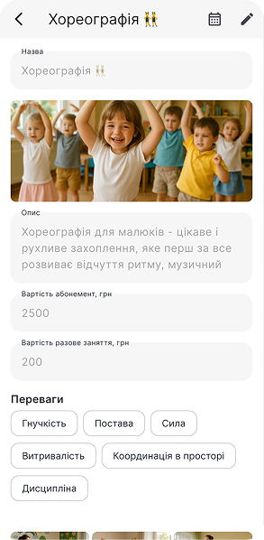
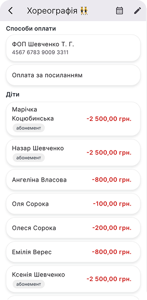

- Баланс дитини по гуртку: Гурток > **Дитина** (внизу зі списку відвідувачів гуртка) > **“+”** зверху > Обираємо тип **“Внести кошти / Нарахувати / Коригування”**

:::info
**Внести** кошти - це завжди ➕ в баланс  
**Нарахувати** - це завжди ➖ в баланс  
**Коригування** - може бути в ➕ і в ➖! Тож при коригуванні ставимо потрібний знак.
:::

:::warning
Абонемент нараховується автоматично **📆 1-го числа поточного місяця**. Разові заняття нараховуються **під час відмітки присутності ✅** та з балансу знімається вартість разового заняття.
:::

#### Відвідуваність гуртків

Фіксація відвідуваності та автоматичні разові нарахування:

- Головна > Гуртки > Поточні / **Не відмічені** > Заняття в помаранчевій рамці > ✅ Галочка присутності відвідувачу

:::success
В цей момент в баланс дитини буде **нараховано вартість разового заняття**, якщо не увімкнено абонемент. Якщо у дитини абонемент, то просто **зберігається статистика** її відвідуваності, що відображається і у батьків.
:::

:::warning
Час на табелювання: **викладач - 6 годин, адміністратор - на протязі всього дня**, натиснувши “Всі сьогоднішні заняття”.
:::

Якщо заявка батьків на підключення гуртка не опрацьована, то в списку табелювання дитина буде відображатися так:

**Як підтвердити заявку на гурток?**

- Головна > **Нові заявки** (там буде вказана їх кількість) > Обираємо заявку > "**Підтвердити**" чи "Скасувати"

Дитина автоматично буде записана на відповідний день та час, який вказаний в заявці.

:::warning ВАЖЛИВО!
**Заявка створюється батьками на одне заняття**. Тож якщо підключаєте абонемент на декілька занять на тиждень, то варто вручну додати дитину в додаткові списки на фіксацію присутності. Приклад: *Хореографія 2 рази на тиждень - вівторок та четвер, 16:00. Зявка прийшла тільки на вівторок, 16:00. Тож цю заявку підтверджуємо (дитина вже автоматично буде в списку вівторка) та додатково вносимо в список заняття четверга.*
:::

#### Редагування присутності

Якщо щось пішло не так 😅 і відповідальні гуртка не відмітили вчасно чи не внесли зміни, то:

- Головна > Поточні / Не відмічені > Гурток > **Місячний звіт гуртка** (верхнє меню) > **Затискаємо комірку**, статус якої редагуємо > **Видаляємо чи додаємо галочку ✅**

:::info
В цей момент в баланс дитини буде **нарахована/видалена** вартість разового заняття, якщо не увімкнено абонемент. Нарахування буде внесене **датою редагування**.
:::

:::warning
Ця функція доступна протягом поточного місяця **тільки адміністратору**.
:::

#### Заявки від батьків

У батьків є каталог додаткового розвитку - список всіх внесених адміністратором гуртків. Вони можуть 24/7 переглядати інформацію та залишати заявку адміністратору. Виглядає **каталог** так:

:::success
**Адміністратору прийде пуш-повідомлення**, коли буде надіслана заявка.
:::

У адімінстратора ця інформація приходить в розділ "Нових заявок". Відкриваємо заявку та **"Підтверджуємо"** чи **"Скасовуємо**" її.

:::info
При підтвердженні дитина **автоматично буде додана в заняття**, яке було обрано батьками.
:::

## Фінанси по дитині

Підключення послуг, управління балансами, швидке внесення коштів та звіти.

- Підключення послуги: Діти > Профіль дитини > **“+”** біля **“Послуги”** > Обираємо з **шаблонів** > **Нараховуємо одразу чи ні?**
- Ведення балансу по підключеній послузі: Профіль дитини > **Послуга** > **“+”** у верхньому меню функцій > “**Внести кошти / Нарахувати / Коригувати**”

:::info
**Внести** кошти - це завжди ➕ в баланс  
**Нарахувати** - це завжди ➖ в баланс  
**Коригування** - може бути в ➕ і в ➖! Тож при коригуванні ставимо потрібний знак.
:::

- Баланс по гуртку: Профіль дитини > **Гурток** > Відкриється історія платежів, де можна вмикати **“Абонемент”** та **“Внести кошти / Нарахувати / Коригувати”**, натискаючи **“+”** зверху

**Як виставити індивідуальну вартість послуги?**

- Профіль дитини > **“...”** на послузі > **Редагувати вартість** > Вказуємо нову суму з індивідуальною знижкою чи вартістю > **“Оновити”**

:::info
**Перевіряємо** зміни в інформації про послугу: **має відображатися нова вартість** на полі послуги, а в дужках базова ціна.
:::

## Новини та події

Ефективне інформування батьків відбувається через розділи новин та подій, які відображаються на головній сторінці в батьківському профілі та не губляться в загальних чатах.

:::success
Тож тут транслюємо **важливі новини, оголошення, події, які варті уваги** батьків. Дашборд покаже **загальну кількість** інформаційних повідомлень по закладу та групам за тиждень.
:::

### Новини

:::warning Хто створює новини?
Новини **групи** - **вихователь, адімінстратор**.  
Новини **закладу** - тільки **адміністратор**.
:::

- Створюємо новину: **Головна** > **Новини** > Обираємо цільову аудиторію, кого інформуватимемо: **заклад** (на зеленому фоні) **чи** окрему **групу** > **"+"** у верхньому правому куті > **Заповнюємо** назву та текст, додаємо зображення (за необхідності) > **"Додати новину"**

- Редагування / видалення: **Головна** > **Новини** > **Обираємо новину** > **"Олівець"** в правому верхньому куті > **Редагуємо** зміст новини **чи** натискаємо **"Видалити"** у верхньому меню.

У батьків на головній сторінці новини відображаються так:

:::info
**Батькам приходить пуш-повідомлення** при доданні нової новини. Помаранчевим виділені непрочитані новини.
:::

### Події

Це розділ **для планових свят, заходів**, **екскурсії** тощо.  
На дашборді показано кількість активних (актуальних на зараз) подій по закладу та групам.

:::success
Інформація про подію з детальним описом **показується у батьків на головній до самої дати події**.
:::

:::warning Хто створює події?
Події **групи** - **вихователь, адімінстратор**.  
Події **закладу** - тільки **адміністратор**.
:::

- Створюємо подію: **Головна** > **Події** > Обираємо цільову аудиторію, кому транслюємо інформацію: **заклад** (на зеленому фоні) **чи** окрему **групу** > **"+"** у верхньому правому куті > **Додати фото**, заголовок, текст, дата (обовʼязково) та час (не обовʼязково) > **"Додати подію"**

- Редагування / видалення: **Головна** > **Події** > **Обираємо подію** > В правому верхньому куті **"Олівець"** (редагування) чи **"Видалити"**.

### Опитування (голосування)

Потрібно зібрати думку батьків, голосування чи інформування, яке потребує обовʼязкової реакції батьків? Використовуємо розділ "Опитування". **У батьків** він відкривається "**Дзвіночком**" у верхньому меню функцій та виглядає так:

- Створюємо опитування: Головна > **Опитування** > **“+”** у верхньому правому куті > **Обираємо групи**, яким надсилаємо опитування > Вмикаємо **Кнопки** чи **Список** > Основна інформація > Варіант(и) **відповіді** > **"Опублікувати"**

- Копіювання вже наявних опитувань: Головна > **Опитування** > Обираємо потрібне опитування > **Копіювати** у верхньому меню функцій > **Редагуємо** інформацію (при необхідності) > **Опублікувати**

**Як нагадати тим, хто ще не проголосував**, без особистих повідомлень?  
Головна > **Опитування** > Обираємо опитування > **"Дзвіночок"** у верхньому меню > **Нагадати**

## Фото

Гелерея закладу, розділена по основним групам.

:::info Хто додає контент?
Фото та відео в групи може додавати **вихователь та адміністратор** закладу.
:::

Додання зображень та відео дітей в галереї груп: Фото > Група > "**+**" зверху > "**Сьогодні**" чи обираємо дату на календарі > Обираємо **файли** з галереї мобільного пристрою > Додаємо **опис** (за потреби, поле не обовʼязкове поле) > "**Завантажити**"

:::warning
Також є опція "**Фонове завантаження**", що дозволяє перевести завантаження контенту в згорнутий режим. Можна переходити на інші сторінки додатку, але **ВАЖЛИВО не закривати додаток Sadok доки не завантажаться файли**!
:::

**Видалення, збереження** зображення: Галерея > Обираємо необхідне фото > "Видалити"/ "Зберегти" / "Поділитися" (у верхньому меню функцій)

## Календар

Календар в профілі адміністратора містить наступну інформацію:

- Дні народження дітей, батьків, працівників
- Події груп
- Події закладу

:::info
Ці дані вносяться під час додання користувачів, подій, тож **редагуються відповідно в профілях та розділі подій**.
:::

## Чат

Основний **конфіденційний комунікатор** адімінстрації закладу з батьками.

Щоб переглянути **групові чати та особисті чати "вихователі-батьки"** - натискаєм на іконки додаткових чатів у верхньому меню:

## Звіти та аналітика

Де шукати звіти по основним та додатковим послугам для керівника?

- **Заборгованість по всім дітям**: Профіль > Діти > “Табличка” у верхньому меню

- **Загальний звіт по всім основним послугам**: Профіль > Послуги > “Табличка” у верхньому меню

- **Звіт по окремій послузі**: Профіль > Послуги > Натискаємо прямо на послугу

- **Загальний звіт по всім гурткам**: Головна > Гуртки > “Табличка” у верхньому меню

- **Звіт по окремому гуртку**: Головна > Гуртки > Обираємо гурток > “Табличка” у верхньому меню

:::info
Всі звіти можна **завантажити в Exel-таблицях**, вони знаходяться під "**стрілкою вниз**" у верхньому меню функцій кожного зі звітів.
:::

## Ми поруч та завжди на звʼязку!

Дякуємо за співпрацю та партнерство!  
Завжди готові допомогти на шляху цифровізації ваших бізнес-процесів:

- 📞 **+38 093 969 00 70**
- 📩 [hello@sadok.app](mailto:hello@sadok.app)
- 💬 [Чат з менеджером](https://t.me/sadokapp)
- 🤖 [Sadok_info_bot](https://t.me/Sadok_info_bot)

### Ідеї та побажання

Ми не зупиняємося та далі створюємо нові функцїї та інструменти для вас 🫶  
Тож будемо вдячні за ідеї 💡, зауваження, побажання - їх можна залишити за посиланням: [скарбничка побажань та ідей](https://forms.gle/MzizKM3HqmCcetjH7)