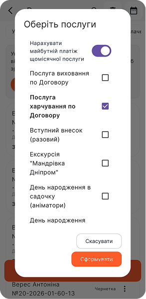
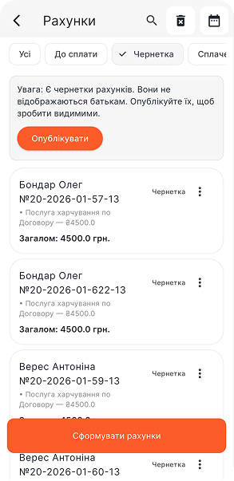
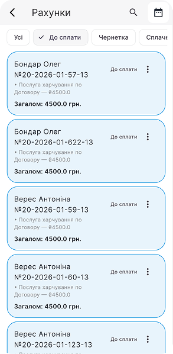
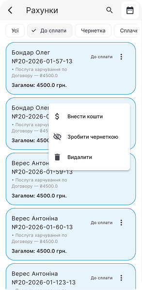
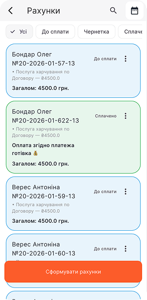

# Крокуємо в Sadok

## Вхід в адміністративний профіль

- Завантажуємо застосунок, обираємо свій варіант операційної системи:
  - [Android](https://play.google.com/store/apps/details?id=app.sadok.sadok_app&pli=1)
  - [Apple iOS](https://apps.apple.com/ua/app/sadok/id6479316640)

- Або скануємо QR-код на сайті та обираємо потрібну операційну систему.
- Входимо під номером закладу, зареєстрованим у системі. Код прийде в **SMS**.

:::info А який номер був внесений?
Основний **номер закладу** чи керівника. Тож варто запитати у особи, що здійснювала реєстрацію закладу в системі.

Якщо залишилися питання, можна [запитати в менеджера Sadok у Telegram-чаті](https://t.me/sadokapp).
:::

## Профіль закладу

Переходимо в розділ **«Профіль»** в нижньому меню застосунку. Саме тут відбуваються основні налаштування.

### Інформація про заклад

Вносимо всі дані про заклад: **Профіль** → **Олівець** на зеленому фоні → заповнюємо відповідні поля інформації, посилання на соцмережі, контакти → **«Зберегти»** у верхньому правому куті.

:::info
Також система пропонує йти по **Стартовому чек-листу** на **Головній**. Він допоможе зробити перші кроки по внесенню користувачів та груп, тож можна слідувати по його маршруту, а можна крокувати далі по цій інструкції.
:::

### Налаштування

Персоналізуємо систему під внутрішні правила та процеси:

- **Обробка вхідних платежів** — підключення банкінгу до системи для автоматичного рознесення оплат в профілі дітей. Інструкція в розділі **«Оплати по API»**.
- **Спільний чат** — використовуєте групові чати? Залишайте увімкненим. Якщо ні — вимикаємо.
- **Чат з вихователем** — дозволяєте особисте спілкування батьків з вихователем? Вмикаємо. Якщо все через адміністратора — вимикаємо.
- **Контакти вихователя** — відкриваємо номер телефону вихователя у батьків? Так — вмикаємо, ні — вимикаємо.
- **Чати гуртків** — додаємо окремі чати по гуртках? Так — вмикаємо, ні — вимикаємо.
- **Контакти батьків у вихователя** — відображаємо номер батьків у вихователя? Так — вмикаємо, ні — вимикаємо.
- **Прізвища батьків у вихователя** — відображаємо прізвища батьків у вихователя? Так — вмикаємо, ні — вимикаємо.
- **Оптимізувати відео** — рекомендовано вмикати.
- **Приховати баланс гуртків** — приховуємо або показуємо баланс та реквізити по гуртках у батьків.
- **Приховати баланс послуг** — приховуємо або показуємо баланс та реквізити по основним послугам у батьків.

### Працівники

Формуємо список команди закладу.

- **Профіль** → **«Додати працівника»** або натискаємо **«+»** у верхньому правому куті → вносимо імʼя, прізвище, основний номер телефону, дату народження → **«Додати»**

#### Працівник і матуся вихованця одночасно — що робимо?

- Вносимо користувача одразу в список **«Батьки»**, додаємо дитину до цього профілю.
- Повертаємося до списку **«Працівники»** → **«+»** → **«Обрати з батьків»** → обираємо зі списку → **«Додати»**

### Батьки та діти

Формуємо основну **клієнтську базу** батьків та вихованців закладу:

- Додаємо батьків: **Профіль** → **Батьки** → **«+»** → дані одного з батьків (згідно [Політики конфіденційності Sadok](https://sadok.app/privacy-policy/) рекомендовано вносити особу з договору) → **«Додати»**
- Додаємо дитину до батьків: профіль батьків → помаранчевий **«+»** під основним номером → дані дитини → **«Додати»**

:::warning Вони одразу дізнаються, що внесені?
**Ні**, користувачам не приходять миттєві сповіщення про внесення їх у систему. Тож спокійно налаштовуйте заклад, потім їх запросите на все готове.
:::

:::info Чому одного? А як бути з іншим?
Згідно [Політики конфіденційності Sadok](https://sadok.app/privacy-policy/) можемо надавати інформацію про дитину тільки тим, з ким юридично оформлена взаємодія. А ця особа вже може доєднати до акаунту дитини всіх, кого вона вважає за потрібне, просто **поділившись SMS**.
:::

#### Інструкція для батьків по підключенню до акаунту дитини інших відповідальних осіб

1. На мобільному пристрої додаткової відповідальної особи завантажується застосунок Sadok.
2. В поле номеру вноситься основний номер акаунту дитини. SMS приходить на основний номер.
3. Основна контактна особа надає код для входу, який їй приходить в SMS.

Підключення робиться один раз. Далі доступ дійсний до натискання кнопки **«Вийти з профілю»**.

### Діти

Цей розділ сформується автоматично. Але ви зможете додати деталей до кожної дитинки:

- **Номер договору**
- **Внутрішня примітка** — важлива інформація від батьків, попередження по взаємодії з дитиною, харчові особливості та алергії, знижки чи особливі умови
- **Особливості дитини** — вподобання, особливості розвитку, темперамент, досягнення тощо

:::warning
**«Особливості дитини»** відображаються **у профілі батьків**, а **«внутрішня примітка»** доступна і **вихователям** групи.
:::

### Групи

Формуємо нашу організаційну структуру — основні функціональні групи:

- **Групи** → **«+»** → назва групи → **«Створити»**

У вас зʼявиться перша група. Відкриваємо її та вносимо інформацію далі.

- Лого, опис, максимальна кількість вихованців: **Група** → **«Олівець»** → **«Олівець»** напроти назви групи → обираємо лого з галереї чи генеруємо з ШІ → **«Зберегти»**

:::info Якщо немає лого?
Можете скористатися **ШІ-помічником** для генерації: натисніть **«...»** на полі логотипу → **«Згенерувати лого»** → внесіть додатковий опис → **«Створити»**.
:::

- Вносимо відповідальних: **Група** → **«Олівець»** → **«+»** біля **«Вихователі»**
- Вносимо дітей: **Група** → **«Олівець»** → **«+»** біля **«Діти»**

:::warning
**Дитина може бути зарахована тільки в одну групу.**  
Щоб перевести дитину з однієї групи в іншу, потрібно видалити її в попередній та додати в нову.
:::

## Check 2

- Документи групи: **Група** → **«+»** біля **«Документи»** → вказуємо назву файлу → **«Вибрати документ»** чи **«Вибрати з галереї»**

:::info
Рекомендовано додавати документи групи у форматі зображень, тоді у батьків ця інформація буде відображена у вигляді галереї.
:::

### Розклад групи

Створюємо інтерактивний розклад, що буде відображатися у батьків та вихователів групи:

- **Група** → **«Олівець»** → **«Олівець»** напроти **«Розклад»** → зверху обираємо **день** → **«+»** додаємо часові проміжки з описом активності

:::success
Для швидкого внесення та зручності **можна копіювати розклад дня**. Достатньо внести його на один день, а далі копіювати і редагувати.
:::

### Реквізити

Тут вказуємо всі **шаблони оплат** ваших послуг і всі можливі способи оплати: **IBAN**, **карта**, **посилання на оплату** та **готівка**.

- **Реквізити** → **«+»** → обираємо **вид оплати** → вносимо дані → **«Зберегти»**

Приклади інформації по полях:

1. **Отримувач:** *ПЗДО «Садок» чи ФОП Шевченко Т.Г.*
2. **Опис способу платежу / Посилання на оплату:** прохання обовʼязково вносити призначення платежу, вказане в рахунку, або посилання на оплату
3. **Призначення платежу:** *Оплата за освітні послуги*
4. **IBAN:** *UA873687634976948746947973264938697836*

:::warning Важливо
В полі **«Призначення платежу»** пишемо лише **початок** назви послуги. **Система сама допише** імʼя та прізвище дитини, номер рахунку та оплатний період.
:::

### Послуги

Розділ для **шаблонів** основних **щомісячних, щотижневих та разових послуг**.

:::info
Також сюди вносимо **гуртки, які не мають чіткого розкладу**, наприклад логопед з плаваючим графіком прийому, екскурсія тощо.
:::

- **Послуги** → **«+»** → вносимо назву → **«Додати»**
- **Нова послуга** → **«...»** → **«Редагувати»** → вносимо вартість → ставимо позначку, якщо послуга щомісячна чи щотижнева → **«Оновити»**
- Приєднуємо способи оплати: **Картка 💳** на послузі → **«Додати спосіб оплати»**

:::info
До послуги можна приєднати **декілька способів оплати**.
:::

:::warning
Щотижнева послуга буде нараховуватися автоматично **щопонеділка**, щомісячна — кожного **1-го числа** місяця.
:::

### Рахунки

Виставлення рахунків по основним та додатковим послугам.

:::warning Крок №1
**Перевіряємо баланси всіх дітей** в розділі **«Діти»**. **Система братиме вартості саме з профілів.**
:::

- **Профіль** → **Рахунки** → **«Усі»** або **«Чернетка»** → **«Сформувати рахунки»** → обираємо послугу → активуємо чи деактивуємо кнопку **«Нарахувати майбутній платіж щомісячної послуги»** → **«Сформувати»**

#### Що це за кнопка «Нарахувати майбутній платіж щомісячної послуги»?

Це функція додання платежу за наступний місяць в рахунок, який генеруємо. Вона дійсна **тільки для щомісячних послуг**.

- **Перевіряємо «Чернетки»** на правильність сум, реквізитів та коментарів.

:::danger
У разі виявлення **помилок** — **видаляємо всі рахунки** та повертаємося до **Кроку №1**.
:::

- Натискаємо **«Опублікувати»**.

:::info Швидке ручне внесення коштів по рахунку
Через опублікований рахунок можна внести кошти в баланс дитини та позначити його сплаченим: **Рахунок** → **«…»** → **«Внести кошти»** → **Далі** → номер квитанції чи коментар → **Підтвердити**
:::

:::info
- ⬜️ **Білі** рахунки — **чернетки**
- 🟦 **Сині** рахунки — **доступні батькам**
- 🟩 **Зелені** рахунки — **сплачені**
:::

### Рахунки по гуртках

Аналогічно рахункам по основним послугам, починаємо з перевірки балансів дітей.

:::warning Крок №1
**Перевіряємо баланси всіх дітей** в розділі **«Діти»** чи в профілі гуртка. **Система братиме вартості саме з балансів по гуртку.**
:::

- **Профіль** → **Рахунки** → **«Сформувати рахунки»** → вкладка **«Гуртки»** → обираємо гуртки → **«Сформувати»**

:::info
- ⬜️ **Білі** рахунки — **чернетки**
- 🟦 **Сині** рахунки — **доступні батькам**
- 🟩 **Зелені** рахунки — **сплачені**
:::

### Оплати по API

**Профіль** → **Налаштування** → **Обробка вхідних платежів** → **«+»** → обираємо банк → слідуємо інструкціям банку

:::warning
Обовʼязковий крок — **обрати рахунок** зі списку доступних, який система моніторитиме для внесення оплат.
:::

:::success
При успішному підключенні банкінгу оплати зʼявлятимуться в розділі **«Банківські платежі»** та **автоматично будуть внесені в баланси дітей** з коректним призначенням платежу.
:::

:::danger
Оплата з некоректним призначенням платежу потребуватиме **ручного внесення** в баланс дитини.
:::

## Автоматизація вже працює

Після пройдених вище кроків вже автоматично створено:

- **База даних**
- **Чати з батьками**
- **Календар**
- **Галерея**
- **Відвідуваність**

## Головна — основний дашборд

Переходимо в розділ **«Головна»** по нижньому меню застосунку.

### Відвідуваність закладу

**Головна** → **Відвідуваність** → **«Не відмічені»** → обираємо групу → **ставимо відмітку ❌ тільки відсутнім**.

Якщо **всі діти групи присутні**, то просто відкриваємо список дітей та закриваємо його — всі дітки позначаться як присутні.

:::info
Табелювання доступне як **вихователю**, так і **адміністратору** закладу **протягом всього робочого дня**.
:::

:::warning Важливо
Інформація **за вчора не редагується**, майбутні дні також не доступні для табелювання. Тільки **сьогодні**.
:::

Батьки можуть попередити про планову відсутність дитини заздалегідь у календарі, натиснувши кнопку **«[Імʼя дитини] сьогодні не прийде»**.

### Гуртки

Створюємо каталог додаткового розвитку, який буде відображатися у батьків.

- **Головна** → **Гуртки** → **«Проведено»** чи **«Поточні»** → **«+»** → вносимо назву гуртка → **«Додати»**
- **Новий гурток** → **«Олівець»** → вносимо опис, зображення, вартість абонементу та разового заняття, переваги, викладача
- Формуємо розклад гуртка
- Додаємо способи оплати
- Додаємо дітей до заняття

#### Абонементи, разові заняття

- Вмикаємо абонемент: **Гурток** → **Дитина** → активуємо кнопку напроти **«Абонемент»**

:::info
**Вартість абонементу** вказана в описі гуртка. Саме його щомісяця система нараховуватиме в баланс дитини.
:::

- Баланс дитини по гуртку: **Гурток** → **Дитина** → **«+»** → **«Внести кошти / Нарахувати / Коригування»**

:::info
- **Внести кошти** — це завжди ➕ в баланс
- **Нарахувати** — це завжди ➖ в баланс
- **Коригування** — може бути і в ➕, і в ➖
:::

:::warning
Абонемент нараховується автоматично **1-го числа поточного місяця**. Разові заняття нараховуються **під час відмітки присутності**.
:::

#### Відвідуваність гуртків

- **Головна** → **Гуртки** → **Поточні / Не відмічені** → ставимо відмітки присутності

:::success
Якщо абонемент не увімкнено, в цей момент в баланс дитини буде **нараховано вартість разового заняття**.
:::

:::warning
Час на табелювання: **викладач — 6 годин, адміністратор — протягом всього дня**.
:::

#### Як підтвердити заявку на гурток?

- **Головна** → **Нові заявки** → обираємо заявку → **«Підтвердити»** чи **«Скасувати»**

:::warning Важливо
**Заявка створюється батьками на одне заняття.** Якщо підключаєте абонемент на декілька занять на тиждень, дитину потрібно вручну додати і в інші заняття.
:::

#### Редагування присутності

- **Головна** → **Поточні / Не відмічені** → **Гурток** → **Місячний звіт гуртка** → змінюємо статус комірки

:::info
В цей момент в баланс дитини буде **нарахована або видалена** вартість разового заняття.
:::

:::warning
Ця функція доступна протягом поточного місяця **тільки адміністратору**.
:::

#### Заявки від батьків

У батьків є каталог додаткового розвитку, де вони можуть залишити заявку адміністратору.

:::success
**Адміністратору прийде push-повідомлення**, коли буде надіслана заявка.
:::

:::info
При підтвердженні дитина **автоматично буде додана в заняття**, яке було обрано батьками.
:::

## Фінанси по дитині

Підключення послуг, управління балансами, швидке внесення коштів та звіти.

- Підключення послуги: **Діти** → **Профіль дитини** → **«+»** біля **«Послуги»**
- Ведення балансу по підключеній послузі: **Профіль дитини** → **Послуга** → **«+»** → **«Внести кошти / Нарахувати / Коригувати»**

:::info
- **Внести кошти** — це завжди ➕ в баланс
- **Нарахувати** — це завжди ➖ в баланс
- **Коригування** — може бути і в ➕, і в ➖
:::

#### Як виставити індивідуальну вартість послуги?

- **Профіль дитини** → **«...»** на послузі → **«Редагувати вартість»** → вказуємо нову суму → **«Оновити»**

:::info
Перевіряємо, щоб відображалася **нова вартість**, а в дужках — базова ціна.
:::

## Новини та події

Ефективне інформування батьків відбувається через розділи новин та подій.

:::success
Тут транслюємо **важливі новини, оголошення та події**, які варті уваги батьків.
:::

### Новини

:::warning Хто створює новини?
- Новини **групи** — **вихователь, адміністратор**
- Новини **закладу** — тільки **адміністратор**
:::

- **Головна** → **Новини** → обираємо аудиторію → **«+»** → заповнюємо назву та текст → **«Додати новину»**

:::info
**Батькам приходить push-повідомлення** при доданні нової новини.
:::

### Події

Це розділ для планових свят, заходів, екскурсій тощо.

:::success
Інформація про подію з детальним описом **показується у батьків на головній до самої дати події**.
:::

:::warning Хто створює події?
- Події **групи** — **вихователь, адміністратор**
- Події **закладу** — тільки **адміністратор**
:::

- **Головна** → **Події** → обираємо аудиторію → **«+»** → додаємо фото, заголовок, текст, дату та час → **«Додати подію»**

### Опитування

Потрібно зібрати думку батьків або провести голосування? Використовуємо розділ **«Опитування»**.

- **Головна** → **Опитування** → **«+»** → обираємо групи → додаємо інформацію та варіанти відповіді → **«Опублікувати»**
- Існуючі опитування можна копіювати та редагувати

#### Як нагадати тим, хто ще не проголосував?

- **Головна** → **Опитування** → обираємо опитування → **«Дзвіночок»** → **«Нагадати»**

## Фото

Галерея закладу, розділена по основним групам.

:::info Хто додає контент?
Фото та відео в групи може додавати **вихователь та адміністратор** закладу.
:::

Додавання контенту:

**Фото** → **Група** → **«+»** → **«Сьогодні»** чи дата → обираємо файли → додаємо опис → **«Завантажити»**

:::warning
Є опція **«Фонове завантаження»**, але важливо **не закривати додаток Sadok**, доки не завантажаться файли.
:::

## Календар

Календар в профілі адміністратора містить:

- Дні народження дітей, батьків, працівників
- Події груп
- Події закладу

:::info
Ці дані вносяться під час додання користувачів та подій.
:::

## Чат

Основний **конфіденційний комунікатор** адміністрації закладу з батьками.

Щоб переглянути **групові чати та особисті чати «вихователі — батьки»**, натискаємо на іконки додаткових чатів у верхньому меню.

## Звіти та аналітика

Де шукати звіти по основним та додатковим послугам для керівника:

- **Заборгованість по всім дітям**: **Профіль** → **Діти** → **«Табличка»**
- **Загальний звіт по всім основним послугам**: **Профіль** → **Послуги** → **«Табличка»**
- **Звіт по окремій послузі**: **Профіль** → **Послуги** → натискаємо прямо на послугу
- **Загальний звіт по всім гурткам**: **Головна** → **Гуртки** → **«Табличка»**
- **Звіт по окремому гуртку**: **Головна** → **Гуртки** → обираємо гурток → **«Табличка»**

:::info
Всі звіти можна **завантажити в Excel-таблицях**.
:::

## Ми поруч та завжди на звʼязку

Дякуємо за співпрацю та партнерство.

Завжди готові допомогти на шляху цифровізації ваших бізнес-процесів:

- 📞 **+38 093 969 00 70**
- 📩 [hello@sadok.app](mailto:hello@sadok.app)
- 💬 [Чат з менеджером](https://t.me/sadokapp)
- 🤖 [Sadok_info_bot](https://t.me/Sadok_info_bot)

### Ідеї та побажання

Ми не зупиняємося та далі створюємо нові функції та інструменти для вас.

Тож будемо вдячні за ідеї, зауваження та побажання:

[Скарбничка побажань та ідей](https://forms.gle/MzizKM3HqmCcetjH7)
