# Моя дитина в Sadok

:::info
**5 хв на знайомство** з мобільним помічником батьків: [Переглянути ВІДЕО](https://youtu.be/dDgHD59Ygx4)
:::

  <iframe
    src="https://www.youtube.com/embed/dDgHD59Ygx4"
    title="YouTube video"
    style={{position: 'absolute', top: 0, left: 0, width: '100%', height: '100%'}}
    frameBorder="0"
    allow="accelerometer; autoplay; clipboard-write; encrypted-media; gyroscope; picture-in-picture; web-share"
    allowFullScreen
  />

## Вхід в систему

- Завантажуємо застосунок, обираємо свій варіант операційної системи за посиланнями:
  - [Android](https://play.google.com/store/apps/details?id=app.sadok.sadok_app&pli=1)
  - [Apple iOS](https://apps.apple.com/ua/app/sadok/id6479316640)

Чи скануємо QR-код, та на сайті обираємо потрібну операційну систему:

- Входимо під номером телефону (основний номер в домовленостях із закладом). Код прийде в **SMS**.

:::info Хто вносить мій номер? В кого дізнатися?
Дані батьків вносить **адміністратор** закладу, тож саме в нього можна **уточнити, змінити чи видалити дані** з системи.
:::

:::success
Успішний вхід - одразу відкриється **профіль дитини**. Зверху буде вказано імʼя дитини, а в профілі - контактні дані основної відповідальної особи.
:::

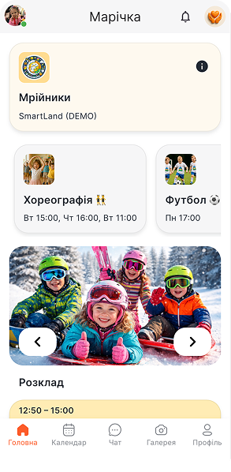
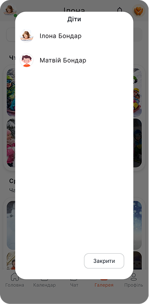

Якщо заклад відвідують **декілька дітей** одного з відповідальних батьків, то перемикаємося між профілями діток у верхньому лівому куті на зображенні дитини.

## Головна

Основна сторінка з інформацією про заклад, групу, події та новини, каталог розвитку. Розглянемо детальніше кожен інформаційний розділ.

### Інформація про заклад

У верхньому правому куті знаходиться логотип закладу, натискаючи на який відкривається **повна інформація про заклад з клікабельними 👈 полями**:

- Ключові переваги
- Розташування
- Сайт 👈
- Електронна пошта 👈
- Номер телефону 👈
- Посилання на соц.мережі Facebook, Instagram 👈

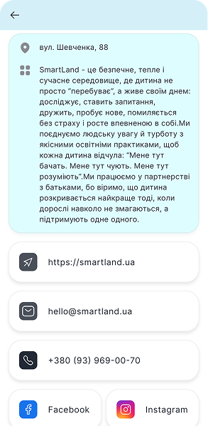

### Голосування та активні сповіщення

**Дзвіночок 🔔** у верхньому полі застосунку - це **конфіденційні голосування, персоналізовані нагадування**, сповіщення з активною дією від батьків.

:::info
**Червона крапка** на 🔔 - нове активне сповіщення, що потребує дії від батьків.
:::

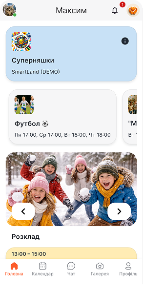
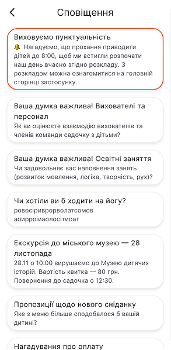

Відкриваємо повідомлення розділу, обираємо запропоновані кнопки чи варіанти відповіді, натискаємо **«Проголосувати»** чи просто натискаємо на запропоновані кнопки, як у варіанті нижче.

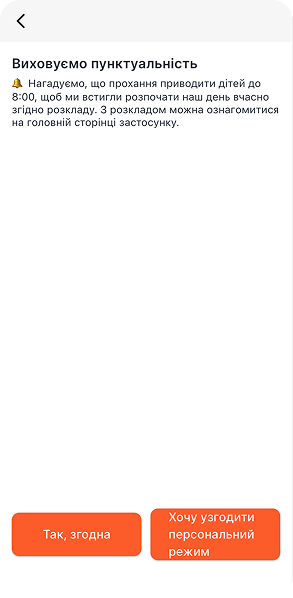
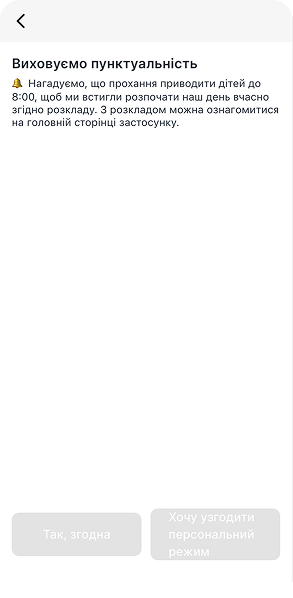

:::warning
Цю інформацію бачить **тільки адміністратор** закладу.
:::

### Інформація про групу

На головній сторінці відображена назва групи, до якої зарахована дитина. Щоб переглянути детальну інформацію про групу, натискаємо на **«і»** в полі групи та переходимо на сторінку, де вказано:

- **Вихователі** та інші відповідальні особи з команди закладу **із швидким набором**, натиснувши на контакт
- Розклад
- Опис
- Документи
- Список дітей

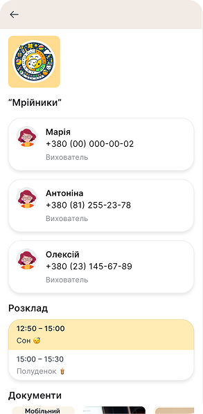
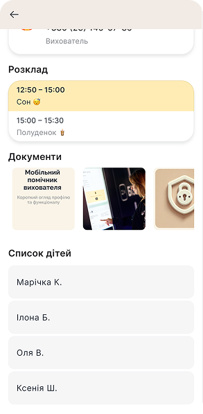

### Каталог додаткового розвитку

Додаткові послуги, **гуртки, студії з можливістю залишити заявку** в будь-який час 🕐.

- **Заявка** на додаткові послуги: **Гуртки** → обираємо розділ → кнопка **«Приєднатися»** → обираємо день та час → **«Підтвердити»**

:::success
Повідомлення **«Очікує підтвердження адміністратора»** свідчить про успішність відправки заявки. Після підтвердження **на головній зʼявиться інформація** про підключений відповідний гурток до дитини.
:::

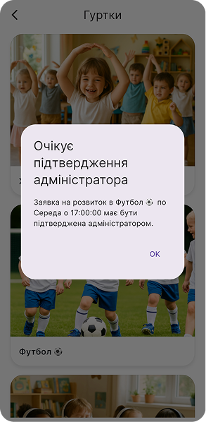

Щоб переглянути **звіт присутності** дитини на заняттях гуртка, заходимо в гурток чи послугу та натискаємо **«Відвідуваність»**.

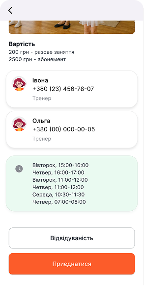
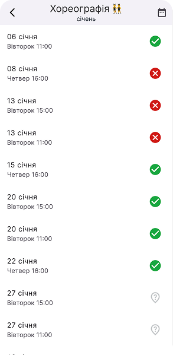

### Розклад

На головній сторінці відображається поточне заняття чи активність згідно розкладу. Щоб переглянути **весь розклад за день** чи **тиждень** - натискаємо на поле розкладу.

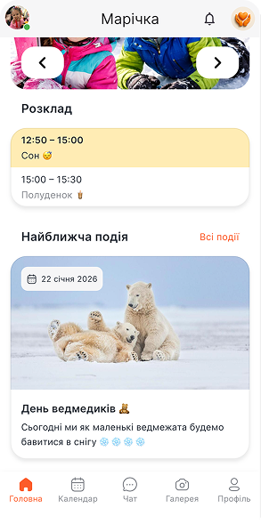
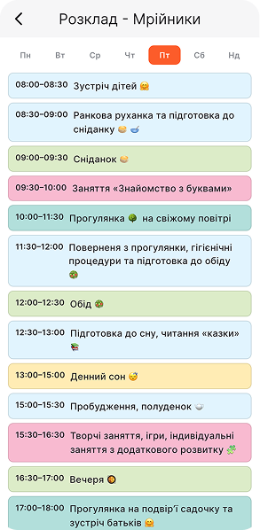

### Найближча подія

Розділ запланованих свят, подій групи. На головній відображається найближча подія. Щоб переглянути минулі та майбутні події - натискаємо **«Всі події»**.

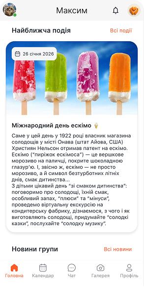
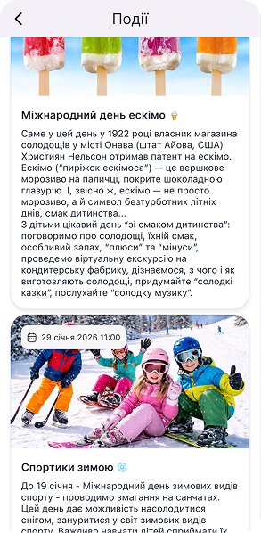

### Новини

Два окремі розділи новин: групи та закладу. При доданні нової інформації в ці розділи приходить push-повідомлення.

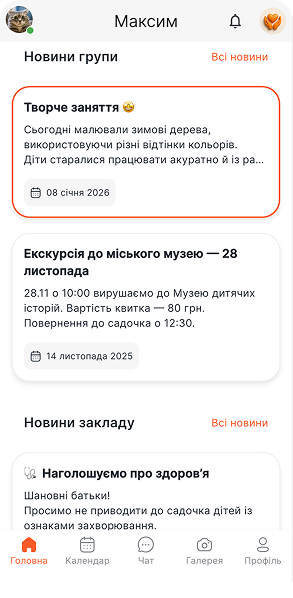
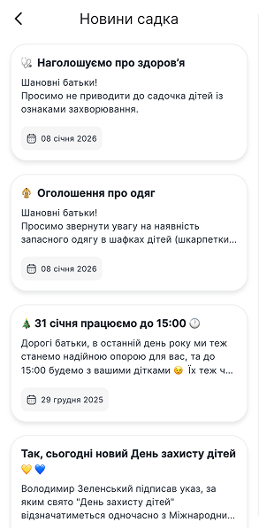
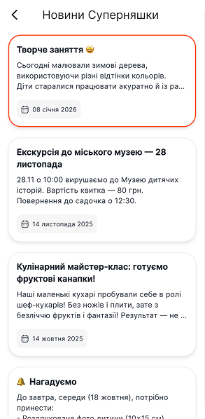

## Календар

**Календар** (в нижньому меню застосунку) складається з **2 розділів: відвідуваність** та **події**, між якими зверху легко перемикаємося.

### Календар подій

Помічник планувальних свят, розвитку та навантаженості дня дитини. Тут **помаранчевою крапочкою 🟠** на даті відображаються:

- Дні народження вихованців групи
- Дні народження вихователів та відповідальних осіб групи
- Події групи
- Події закладу
- Гуртки, студії, додаткові послуги (логопед, психолог тощо), на які записана дитина

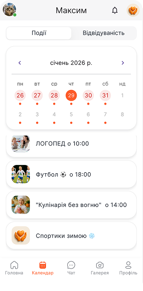

### Відвідуваність

Тут відображається присутність дитини в закладі. Присутність підтверджує вихователь чи адміністратор закладу.

- 🟢 Зелений фон дати - присутність підтверджена
- 🔴 Червоний - була відсутня
- ⚪ Сірий - попередження про планову відсутність
- Прозорий - не відмічено

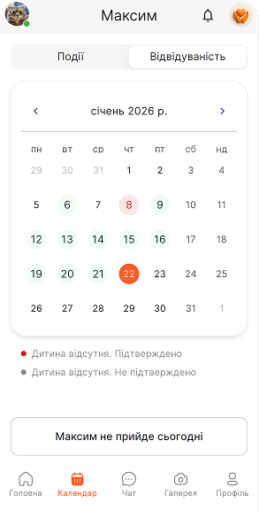
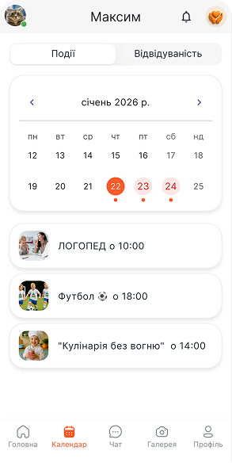

### Як попередити, що дитини не буде в певні дати?

На календарі відвідуваності **обираємо потрібну дату** та натискаємо кнопку внизу **«Імʼя не прийде сьогодні»**. Вихователь та адміністратор побачать відмітку в розділі табелювання дітей.

## Чат

Комунікатор містить 4 типи чатів:

- Адміністрація закладу (за замовчуванням)
- Груповий (за потреби)
- Особистий з вихователями (за потреби)
- Чати по окремим студіям, гурткам (за потреби)

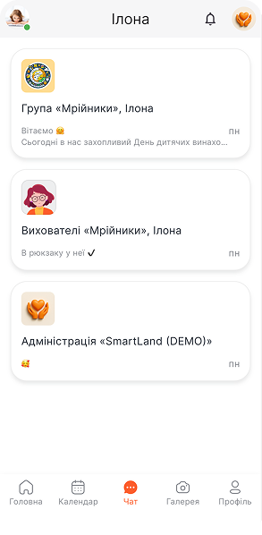

:::info
Цей розділ **налаштовується під заклад**, тож деякі з вказаних видів **можуть бути вимкнені**, в такому разі вони не будуть відображатися.
:::

:::success
У особистих чатах з вихователями є **швидкі повідомлення**, наприклад, **«Запізнюємося, будемо через 10 хв»**, **«Виведіть моє чудо»**, **«Чекаємо на рецепції»** та інші.
:::

Якщо **у батьків дві дитини** відвідують один заклад, то для зручності комунікації **чати консолідуються** та відображаються одразу всі в кожному з профілів дітей.

:::warning
**Адміністратор має доступ до всіх чатів!**
:::

## Галерея

**Територія емоцій та усмішок**  
Розділ, де розміщені фото та відео звіти про день та кожну окрему активність з детальним описом.

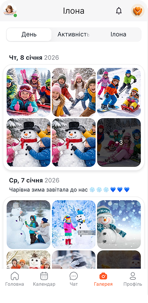
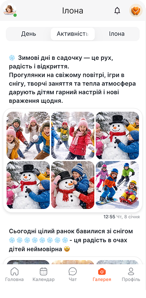
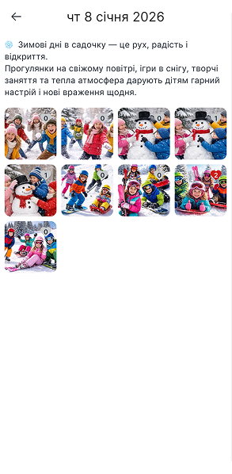

Про додання нової групи фото (активності) дізнаємося з **push-повідомлення**, з якого можемо одразу перейти в галерею групи.

Зображення можна: ♥️ лайкати, ділитися ним та зберігати.

### ШІ-фільтр

Помічник в сортуванні фото саме вашої дитини за допомогою штучного інтелекту.

### Як налаштувати ШІ-фільтр?

**Профіль** → **Розпізнавання фото** → завантажуємо 3 шаблонні фото дитини з хорошою якістю зображення → **Додати**

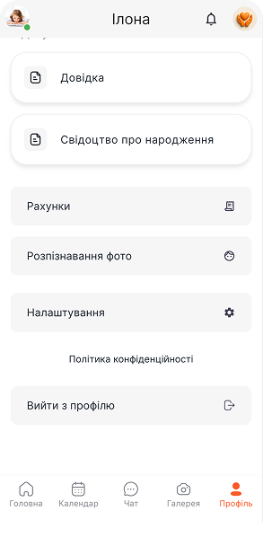
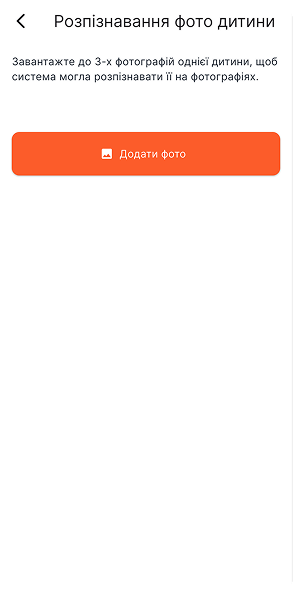

:::warning
Рекомендовано, щоб на фото **не було інших облич та осіб**, щоб штучний інтелект **не плутався**.
:::

:::success
Після налаштування, **з наступного завантаження** ШІ-фільтр почне працювати.
:::

## Профіль

Особливості дитини, відповідальна особа, повна інформація про гуртки та послуги дитини з фінансами, звітами присутності, реквізити для оплати, документами та рахунками.

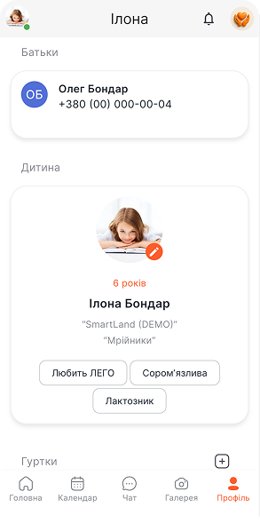

### Батьки та дитина

Інформацію про основну контактну особу (основний номер користувача), особливості дитини **вносить адміністратор** закладу. Тож в разі виявлення відсутності чи некоректної інформації - зверніться до адміністрації закладу в комунікаторі застосунку.

:::info
**Зображення дитини** встановлюється батьками. Натискаємо на **помаранчевий олівець** в зоні аватара дитини та обираємо з галереї найкраще фото.
:::

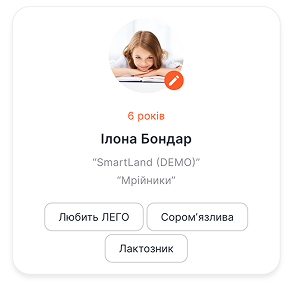

### Підключені гуртки

В профілі можна ознайомитися з балансами по кожній студії розвитку, перевірити підключення абонементу та копіювати реквізити для оплати.

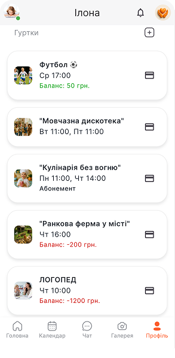

:::success
**Картка** в полі інформації гуртка чи послуги - це **варіанти реквізитів для оплати**. Їх можна копіювати чи поділитися.
:::

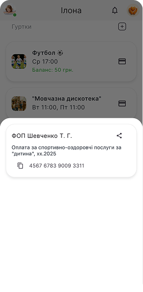

### Як переглянути відвідуваність студії?

Щоб переглянути присутність дитини на заняттях гуртка чи студії - натискаємо прямо на саму додаткову послугу, наприклад, **«Хореографія»**. Відкриється список занять **день-година** з відміткою про присутність ✅ чи відсутність ❌.

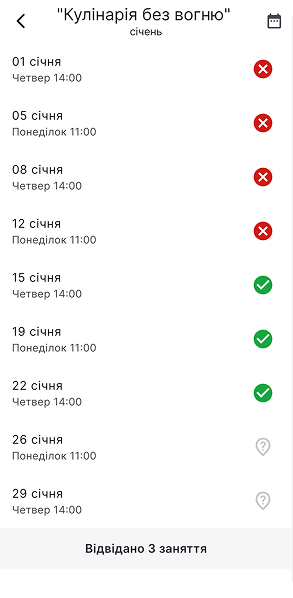

### Послуги

Поточний баланс по основним послугам, щомісячні фіксовані платежі та послуги, які підключені до дитини.

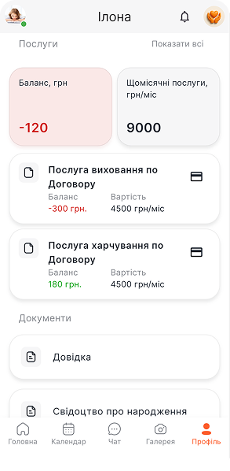

Щоб переглянути всі (щомісячні та разові) послуги, підключені до дитини, натискаємо **«Показати всі»** напроти **«Послуги»**. Потім можемо їх знову приховати, натиснувши **«Сховати сплачені»**.

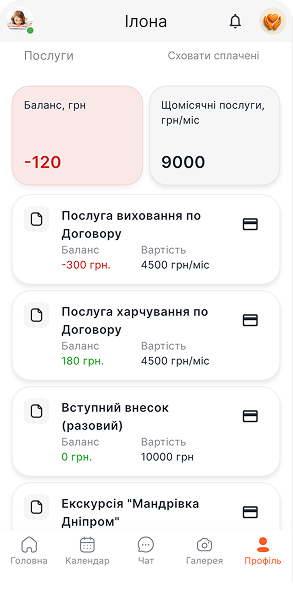

### Як оплатити?

- Спосіб 1: **Картка на послузі** - це варіанти **реквізитів** для оплати. Їх можна копіювати чи поділитися ними.
- Спосіб 2: **Кнопка «Рахунки»** - нижче, під розділом **«Документи»**. Тут також можна ознайомитися з деталізацією нарахувань та копіювати **призначення платежу** і **реквізити** для оплати.

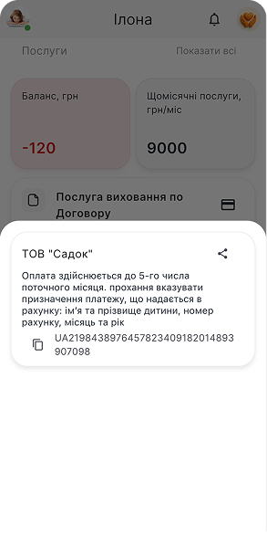

### Документи

Тут відображаються завантажені адміністрацією документи дитини: договір, справки, згоди на обробку даних чи фото тощо.

### Рахунки

Адміністратор закладу формує та публікує рахунки по дитині. В рахунку буде відображено:

- Повний перелік послуг
- Вартість
- Оплатний період
- Реквізити для оплати
- **Автоматично сформований коментар** для призначення платежу
- Статус платежу - фон синій чи зелений

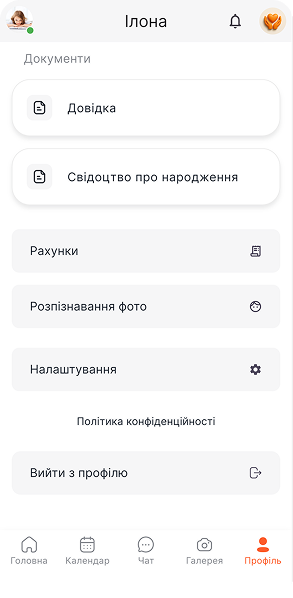
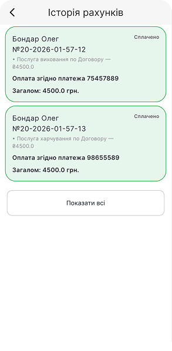
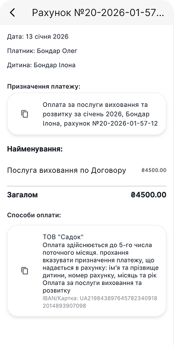

:::info
**Синій фон** рахунку свідчить, що оплата досі **очікується**, **зелений фон** - сплачений рахунок.
:::

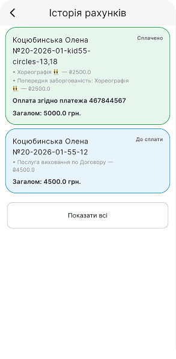

### Налаштування

У батьків є можливість налаштувати сповіщення про нові події, новини, фото-звіти та повідомлення в комунікаторі.

:::info
**Помаранчевий** режим - **увімкнено**, **сірий** - вимкнено.
:::

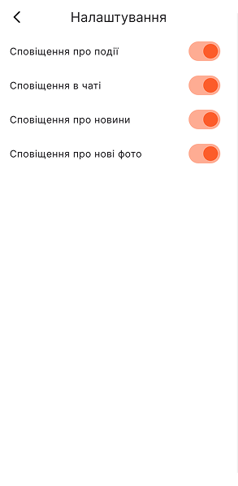

## Перехід між профілями

Перемикаємося між функціональними профілями **у верхньому лівому куті**, на аватарі дитини. Відкривається список профілів, підключених до даного номеру телефону.

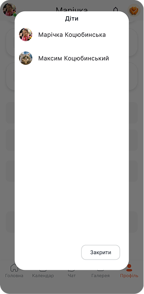

## Команда Sadok на звʼязку!

**Дякуємо за довіру найціннішого!**  
Команда Sadok поруч та завжди готова допомогти в адаптації до цифрового простору освітнього закладу:

- 📞 **+38 093 969 00 70**
- 📩 [hello@sadok.app](mailto:hello@sadok.app)
- 💬 [Чат з менеджером](https://t.me/sadokapp)

### Ідеї та побажання

Ми не зупиняємося та далі створюємо нові функції та інструменти для вас 🫶  
Тож будемо вдячні за ідеї 💡, зауваження, побажання - їх можна залишити за посиланням: [скарбничка побажань та ідей](https://forms.gle/MzizKM3HqmCcetjH7)
