# Sadok - робочий інструмент

:::info
**4 хв на знайомство** зі своїм робочим інструментом: [ВІДЕО тут](https://youtu.be/pX6_4WmbIkQ)
:::

## Вхід в систему

- Завантажуємо застосунок, обираємо свій варіант операційної системи за посиланнями:
  - [Android](https://play.google.com/store/apps/details?id=app.sadok.sadok_app&pli=1)
  - [Apple iOS](https://apps.apple.com/ua/app/sadok/id6479316640)

Чи скануємо **QR-код** та на сайті обираємо потрібну операційну систему:

- Входимо під власним номером, зареєстрованим адміністратором в системі. Код прийде в **SMS**.

:::danger Не приходить SMS?
Контрольно **звіряємося з адміністратором** закладу по правильності внесеного номеру, коректність введення в поле номеру. Якщо все вірно, але система не пускає в профіль — пишіть [сюди в Telegram](https://t.me/sadokapp).
:::

Якщо вхід успішний, та ви додані відповідальним за певну групу, то у вас одразу відкриється головна сторінка профілю вихователя.

## Головна сторінка

"Помаранчевий будиночок" в нижньому меню — це головна сторінка з:

- Останніми зображеннями групи
- Розкладом
- Сьогоднішніми додатковими заняттями в закладі
- Найближчою подією
- Новинами групи
- Новинами закладу

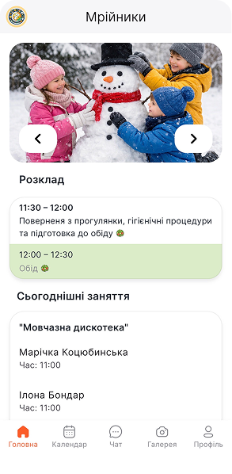

Зараз розглянемо все по порядку...

### Зображення групи (додання контенту)

Щоб завантажити нові фото та відео, переходимо в розділ **«Галерея»** по нижньому меню застосунку.

- Завантаження контенту: **Галерея** → **«+»** у верхньому правому куті → обираємо дату завантаження: **«Сьогодні»** чи **«Обрати»** → обираємо **фото та відео** з галереї мобільного пристрою → додаємо **опис** (за необхідності) → натискаємо кнопку **«Завантажити»**

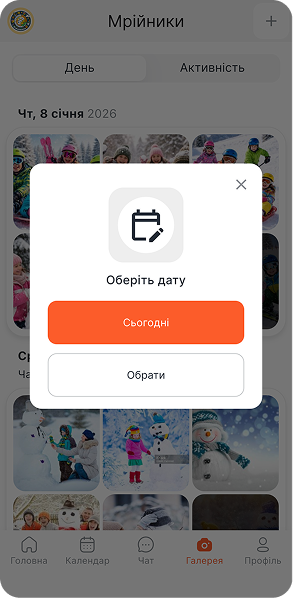

:::info
**За один раз можна обрати до 20 файлів** для завантаження. Якщо необхідно в одну активність додати більше 20 файлів — перед натисканням **«Завантажити»** повторюємо процес обрання зображень та відео, натискаючи **«+»** у верхньому меню.
:::

:::warning
Також є опція **«Фонове завантаження»**, що дозволяє перевести завантаження контенту в згорнутий режим. Можна переходити на інші сторінки додатку, але **важливо не закривати додаток Sadok до завершення завантаження**.
:::

- **Видалення, збереження** зображення: **Галерея** → обираємо необхідний файл → **«Видалити» / «Зберегти» / «Поділитися»** у верхньому меню функцій.

### Розклад

Цей розділ формує та вносить адміністратор закладу. У вихователя він має інформативний характер. Натиснувши на заняття поточного часу, відкриється **повний розклад дня**.

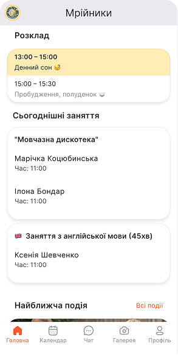

:::info
**Створює та редагує розклад тільки адміністратор**.
:::

### Додатковий розвиток, гуртки та студії

На головній сторінці буде відображено список гуртків та вихованців групи, які записані на додатковий розвиток. Розділ **«Сьогоднішні заняття»** також інформативний, щоб вихователь знав, **кого куди вести на заняття**.

### Події

Інформація про найближчу подію закладу чи групи буде розміщена на головній сторінці. Щоб ознайомитися зі всім списком майбутніх та проведених подій — натискаємо **«Всі події»**.

- Додати подію: **Всі події** → **«+»** у верхньому меню → обираємо **зображення** з шаблонів чи додаємо своє з галереї (теж **«+»** зверху) → **заголовок** → **опис** події → **дата** (обовʼязково) → **час** (не обовʼязково) → кнопка **«Додати подію»**

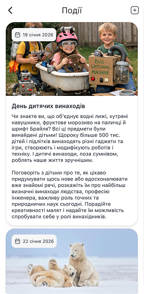
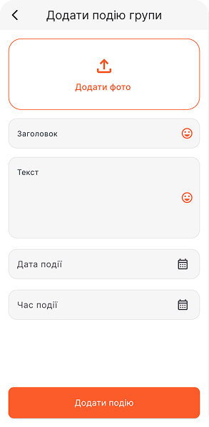

:::warning
Вихователь може додавати **тільки подію групи**. Подію закладу додає адміністратор.
:::

### Новини

Маємо 2 розділи новин: групи та закладу. Новини групи доступні тільки батькам вихованців даної групи. Новини закладу бачать всі батьки закладу.

:::warning
Вихователь може додавати **тільки новини групи**.
:::

- Додати новину групи: **«Всі новини»** (напроти **«Новини групи»**) → **«+»** у верхньому меню → **назва** → **текст** → додаємо фото (за необхідності) → кнопка **«Додати новину»**

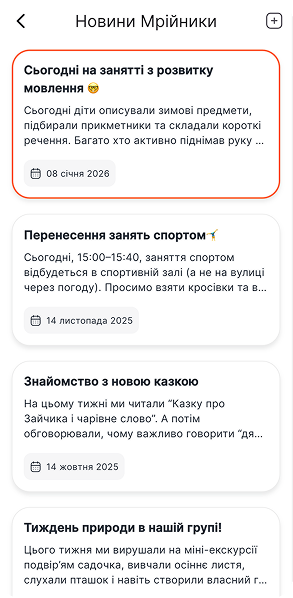
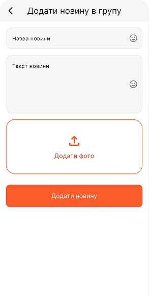

:::info
Щойно ви опублікуєте подію чи новину групи — **усім батькам групи прийде пуш-повідомлення** про нову інформацію для них.
:::

Новини закладу — інформативний розділ для команди, створюється адміністрацією закладу.

## Календар

**«Календар»** по нижньому меню застосунку складається з 2 розділів: **відвідуваність** та **події**, між якими зверху легко перемикаємося.

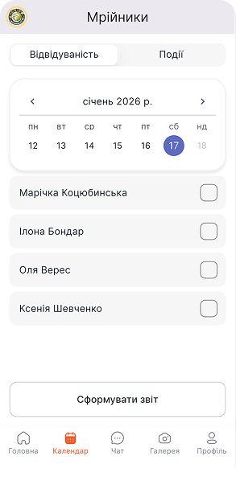
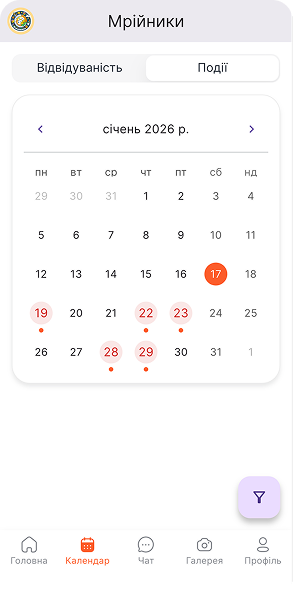
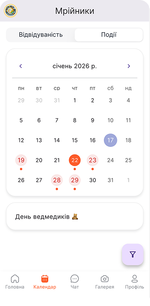
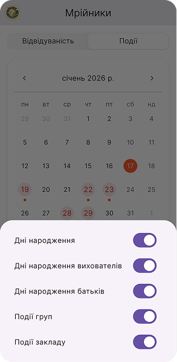

### Відвідуваність

Тут відбувається основне табелювання присутності закладу. Автоматично обрана сьогоднішня дата та список дітей, зарахованих в групу.

:::success Як табелювати?
Напроти **відсутньої дитини** натискаємо на віконце, де **проставляється червоний хрестик** ❌. Інші діти **автоматично** вважаються **присутніми**.
:::

:::info
Час на табелювання: **протягом всього дня** відмітки можуть редагуватися. **Доступ** до табелювання **має і адміністратор** закладу.
:::

:::danger
За **минулі та майбутні дні** дані **не редагуються**. Тільки сьогодні і протягом всього дня.
:::

### З самого ранку бачу вже є хрестик напроти дитини в списку присутності, що це?

Це батьки попередили заклад про **планову відсутність**. Але підтверджує цю інформацію вихователь чи адміністратор закладу, натискаючи на хрестик ❌. Він стане яскраво червоного кольору.

### Календар подій

Це ваш помічник для планувальних свят. Тут **помаранчевою крапочкою 🟠** на даті відображаються:

- Дні народження вихованців групи
- Дні народження вихователів та відповідальних осіб групи
- Дні народження батьків групи
- Події групи
- Події закладу

:::danger Не відображаються певні дати?
Потрібно **звернутися до адміністратора**, щоб він вніс цю інформацію до профілів дітей, батьків та працівників. Система відображає тільки те, що внесено в базу даних.
:::

Також в правому нижньому куті є фільтр подій — можете обрати для відображення тільки певний тип інформації.

## Чат

Розділ оперативної комунікації з батьками групи. Тут маємо **груповий чат** та **особисті чати** з батьками по вихованцям групи.

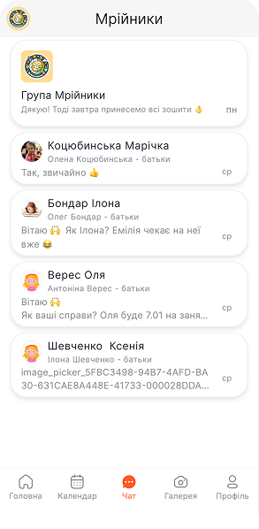

:::info
**Доступ до всіх чатів** вихователя **є в адміністрації** закладу. За необхідності адміністратор може відповідати у всі чати.
:::

## Галерея

Найемоційніша територія застосунку розділена на 2 вкладки: **день** та **активність**.

**Одна група фото** (наприклад, зображення із заняття з англійської) — **це одна активність**. Протягом дня активностей може бути декілька.

:::info
**Система сама обʼєднає в день** всі активності.
:::

:::info
Додавати контент в неї може **як вихователь групи, так і адміністратор**.
:::

- **Завантаження** фото та відео: **Галерея** → **«+»** у верхньому меню → обираємо дату: **«Сьогодні»** чи **«Обрати»** → обираємо **фото та відео** з галереї телефону → додаємо **опис** (за необхідності) → натискаємо кнопку **«Завантажити»**

:::info
**За один раз можна обрати до 20 файлів** для завантаження. Якщо необхідно в одну активність додати більше 20 файлів — перед натисканням **«Завантажити»** повторюємо процес обрання зображень та відео, натискаючи **«+»** у верхньому меню.
:::

- **Видалення** зображень: **Галерея** → **Активність** → потрібне фото → **«Видалити»** у верхньому меню фото.
- **Редагувати опис** дня чи активності: **Галерея** → обираємо активність чи день → знак **«документ»** у верхньому правому куті → редагуємо чи видаляємо текст.

## Профіль

В цьому розділі вказана ваша особиста інформація, інформація про групу та діагностика доступів профілю.

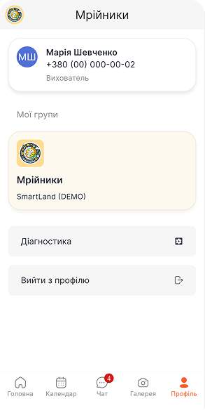

### Інформація про вихованців групи

- **Переглядаємо особливості дитини, внутрішні примітки та контактні дані батьків**: **Профіль** → **Група** → **Діти** → профіль дитини

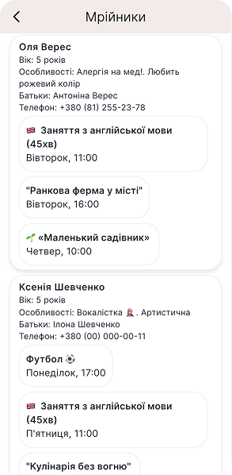

:::warning
**Швидкий телефонний виклик батьків** — просто натискаємо на профіль дитини в інформації групи.
:::

### Діагностика або "швидка технічна самодопомога"

Якщо виникають такі питання:

:::danger
**Не відкривається галерея** телефону для завантаження фото?
:::

:::danger
**Не приходять сповіщення** та пуш-повідомлення?
:::

:::danger
**Не завантажує контент** в галерею, достатньо памʼяті?
:::

:::success
Відкриваємо розділ **«Діагностика»**: надаємо дозволи, очищуємо оперативну памʼять від кешу та документів, просто натискаючи відповідні кнопки.
:::

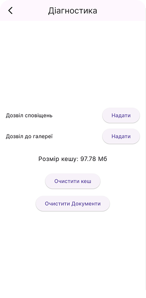

## Поєднання профілів вихователя та викладача студій

Якщо вихователь одночасно є і відповідальним за заняття додаткового розвитку (студії, гуртки), то **перехід між профілями відбувається у верхньому лівому куті**, натискаючи на **логотип групи**.

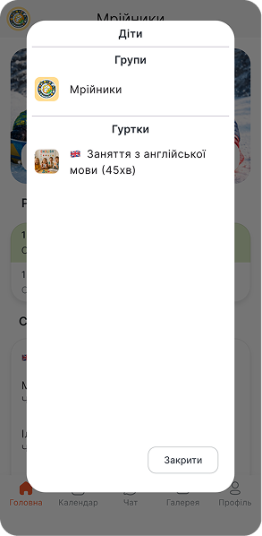

:::info Хто має доступ до обʼєднання профілів?
Тільки **адміністратор** закладу призначає відповідальних за групи та гуртки. Після цього вони автоматично відображаються у профілі відповідальної особи.
:::

## На звʼязку!

**Дякуємо за віддану працю та неоціненний вклад в розвиток майбутнього України 🇺🇦!** Команда Sadok поруч та завжди готова допомогти в автоматизації ваших рутинних задач:

- 📞 **+38 093 969 00 70**
- 📩 [hello@sadok.app](mailto:hello@sadok.app)
- 💬 [Чат з менеджером](https://t.me/sadokapp)
- 🤖 [Sadok_info_bot](https://t.me/Sadok_info_bot)

### Ідеї та побажання

Ми не зупиняємося та далі створюємо нові функції та інструменти для вас 🫶  
Тож будемо вдячні за ідеї 💡, зауваження, побажання — їх можна залишити за посиланням: [скарбничка побажань та ідей](https://forms.gle/MzizKM3HqmCcetjH7)