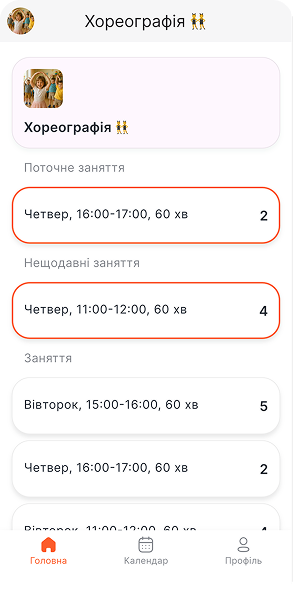
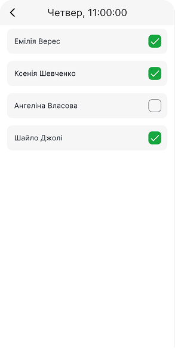
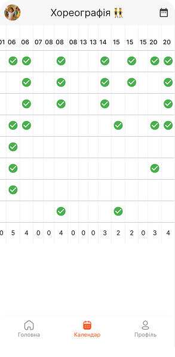
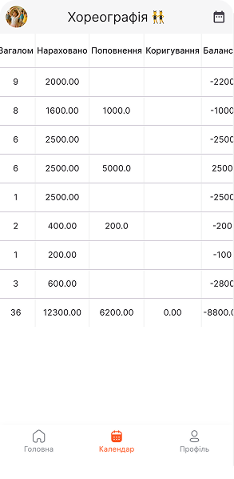
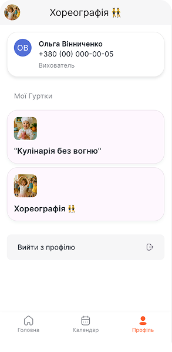
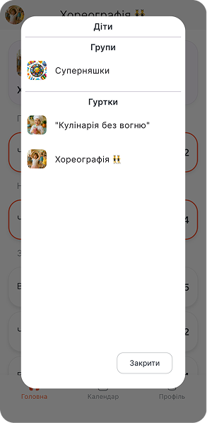

# Sadok для викладачів гуртків та студій

## Головна

На головній сторінці відображається графік занять на тиждень. В помаранчевій рамці виділене заняття, яке доступне до відмічання присутності (табелювання).

:::info
**Час на табелювання:** заняття відкрите для відміток присутності **протягом 6 годин** після його завершення.
:::

**Доступ до внесення та редагування** інформації присутності мають: **адміністратор** закладу та **відповідальний за гурток** (підключений до гуртка працівник).

:::danger Якщо не встигли проставити відмітки, що робити?
Звертаємося **до адміністратора** закладу. Він має доступ протягом усього місяця редагувати інформацію у звіті присутності.
:::

## Календар

В календарі відображається **поточний місячний звіт** присутності дітей з фінансовими показниками: нараховано, поповнення, коригування та загальний баланс.

## Профіль

Інформація про зареєстрований номер та підключені гуртки до викладача вказані в профілі:

### Як перемикатися між гуртками?

В лівому верхньому куті **натискаємо на лого гуртка**. Відкриється вікно з підключеними студіями розвитку, групами чи профілями діток. Обираємо потрібний профіль.

## Команда Sadok на звʼязку!

Ми поруч та завжди готові допомогти в адаптації до цифрового простору освітнього закладу:

- 📞 **+38 093 969 00 70**
- 📩 [hello@sadok.app](mailto:hello@sadok.app)
- 💬 [Чат з менеджером](https://t.me/sadokapp)

### Ідеї та побажання

Ми не зупиняємося та далі створюємо нові функції та інструменти для вас 🫶  
Тож будемо вдячні за ідеї 💡, зауваження, побажання — їх можна залишити за посиланням: [скарбничка побажань та ідей](https://forms.gle/MzizKM3HqmCcetjH7)